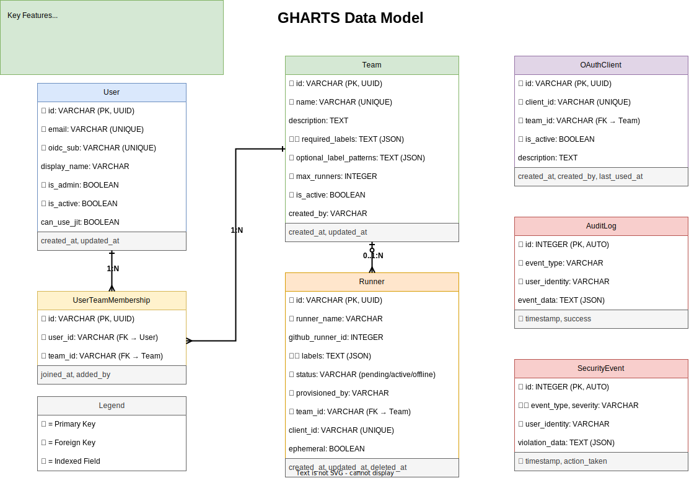

# GitHub Runner Token Service - Documentation

## Overview

The **Runner Token Service** is a secure central service that enables third parties to provision GitHub self-hosted runners through OIDC authentication, without exposing privileged credentials.

### What This Solves

**Problem**: You want third parties to provision GitHub self-hosted runners, but don't want to give them:
- Your GitHub PAT (too much access)
- Direct access to GitHub App credentials (security risk)
- Ability to provision runners for other users (isolation concern)
- Ability to bypass label policies or ephemeral settings

**Solution**: This service acts as a secure intermediary using JIT (Just-In-Time) provisioning:
1. Third party authenticates with OIDC (their identity provider)
2. Service validates OIDC token and enforces label policies
3. Service generates JIT config with pre-bound labels and ephemeral mode
4. Third party starts runner directly (no config step, no way to bypass settings)
5. Service monitors runners and detects label drift

## Key Features

✅ **JIT Provisioning** - Server-side label and ephemeral enforcement (recommended)
✅ **OIDC Authentication** - Third parties authenticate with their own identity provider
✅ **GitHub App Integration** - Service uses GitHub App with minimal required permissions
✅ **Label Policy Enforcement** - Fine-grained control over permitted runner labels
✅ **Label Drift Detection** - Automatic detection and remediation of modified labels
✅ **User Isolation** - Users can only see/manage their own runners
✅ **Ephemeral Runners** - Always enabled with JIT, runners auto-delete after one job
✅ **Audit Trail** - All operations logged with user identity
✅ **Security Events** - Dedicated logging for policy violations
✅ **Periodic Sync** - Automatic status synchronization with GitHub API
✅ **RESTful API** - Clean, documented API with OpenAPI/Swagger
✅ **CLI Tools** - Admin commands for maintenance and monitoring
✅ **Dashboard** - Web UI for monitoring runners and viewing audit logs

## Documentation Index

### Getting Started
- [Quick Start Guide](quickstart.md) - Get up and running in 5 minutes with JIT provisioning
- [Usage Examples](usage_examples.md) - Practical examples and workflows

### Development
- [Development Guide](development.md) - Setting up development environment, OIDC configuration
- [OIDC Setup Guide](oidc_setup.md) - Complete OIDC configuration and authentication flows

### Operations
- [Demo Script](demo.md) - Comprehensive demonstration of system capabilities
- [Deployment Checklist](DEPLOYMENT_CHECKLIST.md) - Production deployment guide
- [Team Management Guide](TEAM_MANAGEMENT.md) - Team-based authorization workflows
- [API Contract](API_CONTRACT.md) - API specifications and compatibility

### Design & Architecture
- [JIT Provisioning Design](design/jit_provisioning.md) - JIT architecture and security benefits
- [Architecture](design/token_service.md) - System design and technical architecture
- [GitHub Sync Design](design/github_sync.md) - Periodic sync and label drift detection
- [Dashboard Design](design/dashboard.md) - Web dashboard specifications and design
- [Design Overview](design/README.md) - Overview of design documents

## Project Structure

```
runner-token-service/
├── app/                        # Main application
│   ├── api/v1/                # REST API endpoints
│   │   ├── runners.py         # Runner management endpoints
│   │   └── admin.py           # Admin endpoints
│   ├── auth/                   # Authentication
│   │   ├── dependencies.py    # Auth middleware
│   │   └── oidc.py            # OIDC validation
│   ├── services/               # Business logic
│   │   ├── runner_service.py  # Runner provisioning
│   │   └── label_policy_service.py  # Label policy
│   ├── github/                 # GitHub integration
│   │   ├── app_auth.py        # GitHub App auth
│   │   └── client.py          # GitHub API client
│   ├── templates/              # HTML templates
│   │   └── dashboard.html     # Web dashboard
│   ├── models.py              # Database models
│   ├── schemas.py             # API schemas
│   ├── database.py            # Database setup
│   ├── config.py              # Configuration
│   ├── cli.py                 # CLI commands
│   └── main.py                # FastAPI app
├── tests/                      # Test suite
├── requirements.txt            # Python dependencies
├── docker-compose.yml          # Docker compose setup
└── Dockerfile                  # Docker image
```

## Data Model

The service uses a relational database with the following core tables:



**Core Tables:**
- **User**: Authenticated users with OIDC integration
- **Team**: Organizational units with label policies and quotas
- **UserTeamMembership**: Many-to-many relationship between users and teams
- **Runner**: Self-hosted GitHub runners with status tracking
- **LabelPolicy**: User-based label policies (legacy, being migrated to teams)
- **AuditLog**: Complete audit trail of all operations
- **SecurityEvent**: Security violations and policy enforcement events

See the [data model diagram](diagrams/data_model.svg) for detailed schema and relationships.

## Key Concepts

### Runner States

Runners progress through these states:
- **pending**: Runner provisioned but not yet registered with GitHub
- **active**: Runner registered and idle, ready for jobs
- **offline**: Runner registered but offline/unreachable
- **deleted**: Runner removed from GitHub or deprovisioned

### Sync Process

The service includes automatic periodic sync (every 5 minutes by default) that:
- Updates runner statuses to match GitHub's actual state
- Detects label drift for JIT-provisioned runners
- Removes runners that no longer exist in GitHub

For JIT runners, sync happens immediately at provisioning time. Manual sync is available via CLI:
```bash
python -m app.cli sync-github
```

### Ephemeral Runners

Ephemeral runners are the default with JIT provisioning. They:
- Execute a single job
- Automatically terminate
- Clean up their own state
- Ideal for untrusted/third-party code

**Note:** With JIT, ephemeral mode is always enforced server-side and cannot be disabled by clients.

### Label Policies

Label policies provide fine-grained access control:
- Define which labels users can assign
- Support regex patterns and wildcards
- Validated during provisioning
- Verified post-registration

## Security Considerations

- All API calls require OIDC authentication
- GitHub App uses minimal required permissions
- Registration tokens have 1-hour expiration
- All operations audited and logged
- User isolation prevents cross-user access
- Label policies enforce organizational boundaries

## API Endpoints

See [USAGE_EXAMPLES.md](USAGE_EXAMPLES.md) for detailed API examples.

### JIT Provisioning (Recommended)
- `POST /api/v1/runners/jit` - Provision runner with JIT config (server-enforced labels/ephemeral)

### Runner Management
- `GET /api/v1/runners` - List user's runners
- `GET /api/v1/runners/{runner_id}` - Get runner details
- `POST /api/v1/runners/{runner_id}/refresh` - Sync status from GitHub
- `DELETE /api/v1/runners/{runner_id}` - Deprovision runner

### Alternative (Legacy)
- `POST /api/v1/runners/provision` - Generate registration token (client-side configuration)

## CLI Commands

```bash
# Initialize database
python -m app.cli init-db

# Sync with GitHub (update runner statuses)
python -m app.cli sync-github

# List runners
python -m app.cli list-runners

# Cleanup stale runners
python -m app.cli cleanup-stale-runners --hours 24 --dry-run

# Export audit log
python -m app.cli export-audit-log --output audit.json
```

See [DEVELOPMENT.md](DEVELOPMENT.md) for full CLI documentation.

## Support

- 📖 [Full API Documentation](http://localhost:8000/docs) - Interactive Swagger UI
- 🔗 [GitHub Repository](https://github.com/afrittoli/gha-runner-token-service)
- 📝 [Issues & Discussions](https://github.com/afrittoli/gha-runner-token-service/issues)
