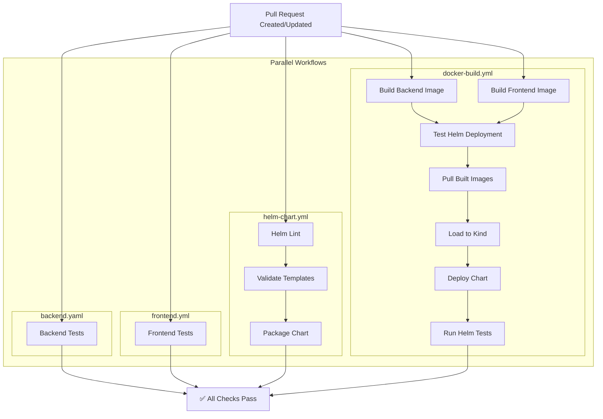
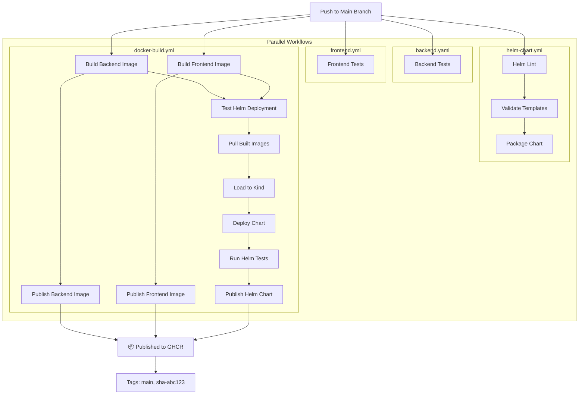
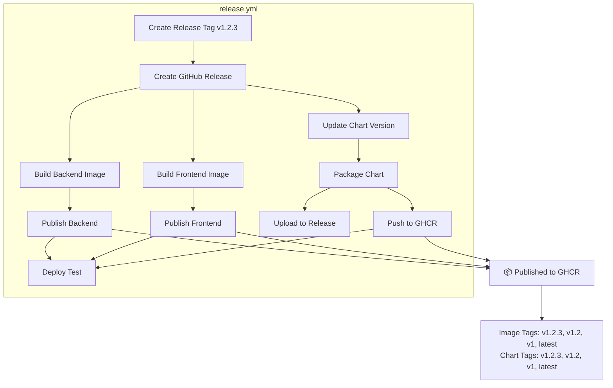

# CI/CD Workflows

This document describes the continuous integration and deployment workflows for the GitHub Actions Runner Token Service.

## Overview

The project uses GitHub Actions for CI/CD with the following workflows:

- [**backend.yaml**](../.github/workflows/backend.yaml) - Backend tests and linting
- [**frontend.yml**](../.github/workflows/frontend.yml) - Frontend tests, linting, and build
- [**helm-chart.yml**](../.github/workflows/helm-chart.yml) - Helm chart validation
- [**docker-build.yml**](../.github/workflows/docker-build.yml) - Build images, test Helm deployment, publish artifacts
- [**release.yml**](../.github/workflows/release.yml) - Create releases and publish versioned artifacts

## Workflow Diagrams

### Pull Request Flow

When a pull request is created or updated, multiple workflows run in parallel:



**Key Points:**
- All workflows run in parallel for fast feedback
- Images are built but NOT published on PRs
- Helm chart is validated and tested but NOT published
- Full deployment test runs in kind cluster using built images

### Main Branch Push Flow

When code is pushed to the main branch, the same workflows run but with publishing enabled:



**Key Points:**
- Images published to GHCR with `main` and `sha-<commit>` tags
- Helm chart published to GHCR with same tags
- Publishing only happens AFTER successful Helm deployment test
- No `latest` tag on main branch pushes (only on releases)

### Release Tag Flow

When a release tag (e.g., `v1.2.3`) is created:



**Key Points:**
- Creates GitHub Release with release notes
- Builds and publishes images with semantic version tags
- Updates chart version to match release
- Publishes chart to both GitHub Release (`.tgz`) and GHCR (OCI)
- Runs deployment verification test
- Only releases get the `latest` tag


## Publishing Strategy

### Image Tags

| Event | Backend Tags | Frontend Tags |
|-------|-------------|---------------|
| **PR** | Not published | Not published |
| **Main Push** | `main`, `sha-<commit>` | `main`, `sha-<commit>` |
| **Release v1.2.3** | `v1.2.3`, `v1.2`, `v1`, `latest` | `v1.2.3`, `v1.2`, `v1`, `latest` |

### Helm Chart Tags

| Event | Chart Tags | Location |
|-------|-----------|----------|
| **PR** | Not published | N/A |
| **Main Push** | `main`, `sha-<commit>` | GHCR OCI |
| **Release v1.2.3** | `v1.2.3`, `v1.2`, `v1`, `latest` | GHCR OCI + GitHub Release |

**Important:** The `latest` tag is ONLY applied on releases, not on main branch pushes.

## Optimization Strategies

### Build Caching

- Docker layer caching via GitHub Actions cache
- Speeds up subsequent builds significantly
- Shared across workflow runs

### Parallel Execution

- Independent workflows run in parallel
- Reduces total CI time
- Fast feedback on failures

### Image Reuse

- Images built once in `docker-build.yml`
- Same images pulled for Helm testing
- Avoids duplicate builds
- Ensures consistency

### Conditional Publishing

- Images/charts only published on main branch
- PRs build and test but don't publish
- Reduces registry clutter
- Saves bandwidth

## Secrets and Permissions

### Required Secrets

- `GITHUB_TOKEN` - Automatically provided by GitHub Actions
- `CODECOV_TOKEN` - Optional, for code coverage reporting

### Required Permissions

**docker-build.yml:**
- `contents: read` - Read repository
- `packages: write` - Publish to GHCR
- `packages: read` - Pull images for testing

**release.yml:**
- `contents: write` - Create releases
- `packages: write` - Publish to GHCR

## Monitoring and Debugging

### Viewing Workflow Runs

```bash
# View recent workflow runs
gh run list

# View specific run
gh run view <run-id>

# Watch a running workflow
gh run watch
```

### Common Issues

**Build Failures:**
- Check build logs in GitHub Actions
- Verify Dockerfile syntax
- Check for dependency issues

**Test Failures:**
- Review test output in workflow logs
- Check for flaky tests
- Verify test environment setup

**Helm Deployment Failures:**
- Check pod logs in workflow output
- Verify chart templates
- Check resource limits
- Review PostgreSQL startup

**Publishing Failures:**
- Verify GITHUB_TOKEN permissions
- Check registry authentication
- Verify tag format

### Debugging Locally

```bash
# Test backend build
make build-backend

# Test frontend build
make build-frontend

# Test Helm chart
make helm-test

# Test Helm deployment locally
make helm-install-local
```

## Best Practices

### For Contributors

1. **Run tests locally** before pushing
2. **Keep PRs focused** to reduce CI time
3. **Fix failing tests** promptly
4. **Review workflow logs** when builds fail

### For Maintainers

1. **Monitor workflow success rates**
2. **Keep dependencies updated**
3. **Review and optimize slow workflows**
4. **Maintain build cache efficiency**
5. **Document workflow changes**

## Future Enhancements

Potential improvements to consider:

1. **Chart Signing** - Add cosign signing for Helm charts
2. **Security Scanning** - Add Trivy or Snyk scanning
3. **Performance Testing** - Add load testing to CI
4. **Multi-cluster Testing** - Test on different K8s versions
5. **Automated Rollback** - Auto-rollback on deployment failures
6. **Slack Notifications** - Notify on build failures
7. **Deployment Previews** - Preview environments for PRs

## References

- [GitHub Actions Documentation](https://docs.github.com/en/actions)
- [Docker Build Push Action](https://github.com/docker/build-push-action)
- [Helm Actions](https://github.com/helm/kind-action)
- [GHCR Documentation](https://docs.github.com/en/packages/working-with-a-github-packages-registry/working-with-the-container-registry)

## Support

For CI/CD issues:
- Check [GitHub Actions logs](https://github.com/afrittoli/gha-runner-token-service/actions)
- Review [workflow files](.github/workflows/)
- Open an [issue](https://github.com/afrittoli/gha-runner-token-service/issues)