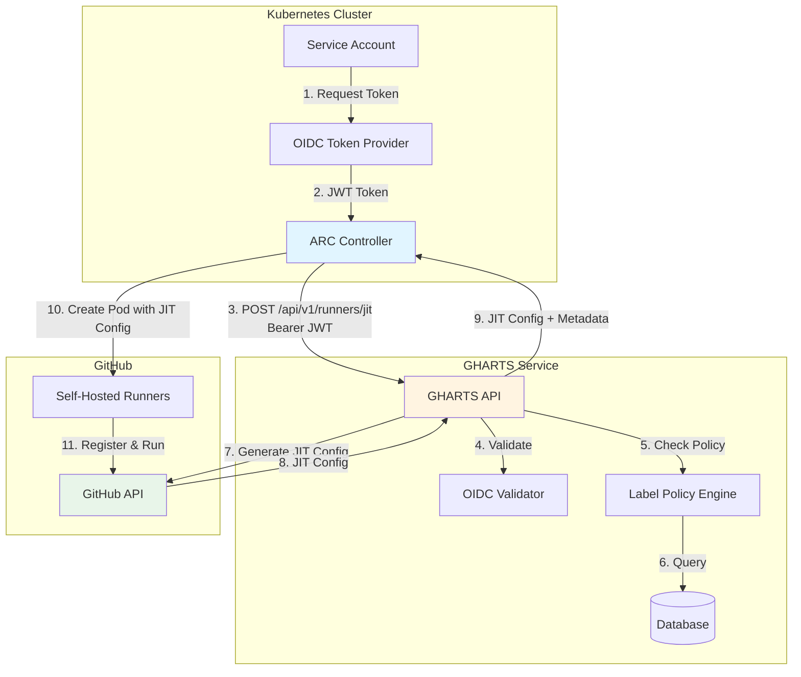
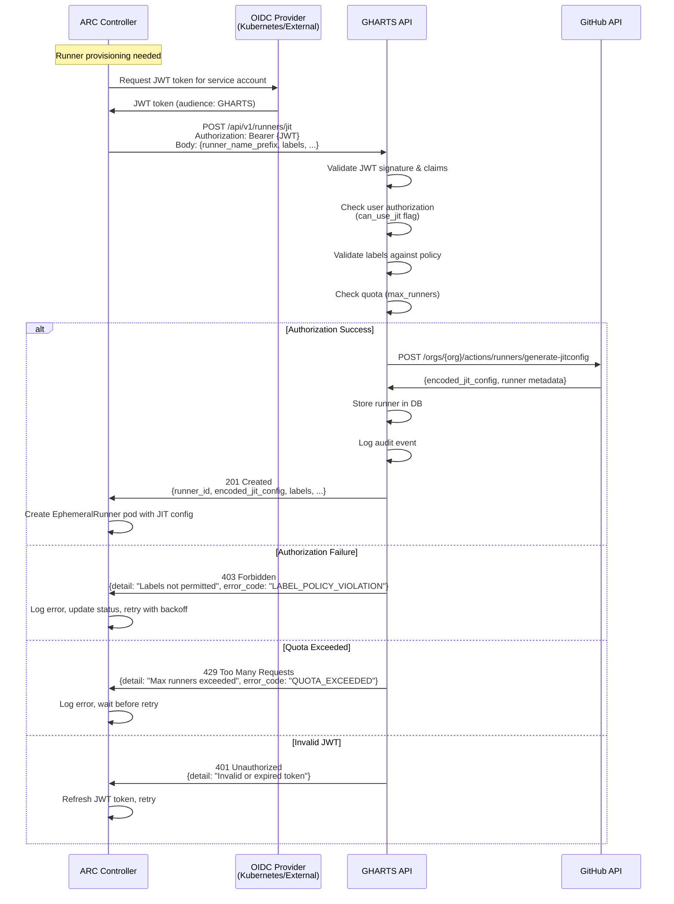
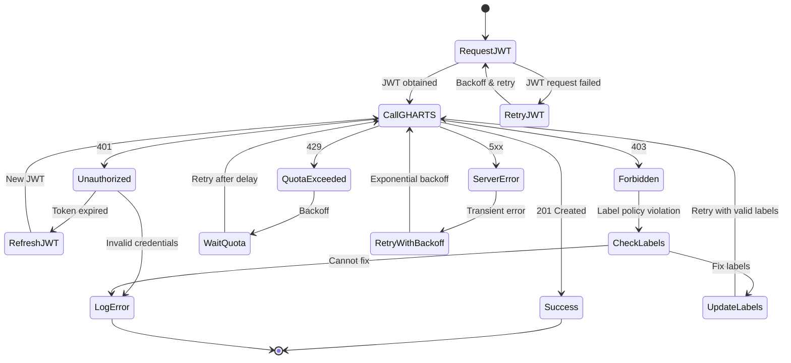

# ARC-GHARTS Integration Design

## Executive Summary

This document outlines the integration strategy for **Actions Runner Controller (ARC)** to use **GitHub Runner Token Service (GHARTS)** as an **alternative authentication method** for runner provisioning via OIDC, while maintaining full backward compatibility with the existing GitHub App authentication.

### Key Benefits
- **Enhanced Security**: OIDC-based authentication with short-lived JWT tokens
- **Centralized Control**: Label policy enforcement and quota management via GHARTS
- **Audit Trail**: Comprehensive logging of all runner provisioning activities
- **Flexible Authorization**: Per-user/service-account access control
- **Full Backward Compatibility**: Existing GitHub App authentication remains default and fully functional
- **Easy Fork Maintenance**: Minimal changes to core ARC code, isolated GHARTS integration

### Fork Maintenance Strategy
This design prioritizes **minimal divergence** from upstream ARC to facilitate easy merging of upstream fixes:
- GHARTS integration is **additive only** - no modifications to existing GitHub App code paths
- All GHARTS code isolated in new packages/files
- Feature flag controls which authentication method to use
- Zero impact on existing ARC functionality when GHARTS is disabled

---

## Current State Analysis

### GHARTS (gha-runner-token-service)
**Language**: Python (FastAPI)  
**Authentication**: OIDC (JWT tokens)  
**Key Endpoints**:
- `POST /api/v1/runners/provision` - Registration token flow (legacy)
- `POST /api/v1/runners/jit` - JIT configuration flow (recommended)
- `GET /api/v1/runners` - List runners
- `DELETE /api/v1/runners/{id}` - Deprovision runner

**Features**:
- OIDC token validation against provider's JWKS
- Label policy enforcement (allowed labels + regex patterns)
- User authorization (can_use_registration_token, can_use_jit flags)
- Quota management (max_runners per user)
- Security event logging
- Audit trail

### ARC (actions-runner-controller)
**Language**: Go (Kubernetes Operator)  
**Current Authentication**: GitHub App (App ID + Private Key)  
**Key Components**:
- `github.Client` - GitHub API wrapper
- `AutoscalingRunnerSetReconciler` - Manages runner scale sets
- `EphemeralRunnerSetReconciler` - Manages ephemeral runners

**Current Flow**:
1. ARC uses GitHub App credentials to authenticate
2. Calls GitHub API directly to create registration tokens
3. Provisions runners with tokens
4. Manages runner lifecycle

---

## Integration Architecture

### High-Level Design



### Authentication Flow



### Error Handling Flow



---

## Implementation Details

### 1. New GHARTS Client in ARC

Create a new Go package: `github.com/actions/actions-runner-controller/gharts`

**File**: `gharts/client.go`

```go
package gharts

import (
    "context"
    "encoding/json"
    "fmt"
    "net/http"
    "time"
)

// Config contains configuration for GHARTS client
type Config struct {
    // BaseURL is the GHARTS API base URL (e.g., "https://gharts.example.com")
    BaseURL string
    
    // OIDCTokenProvider provides JWT tokens for authentication
    OIDCTokenProvider TokenProvider
    
    // HTTPClient for making requests (optional, uses default if nil)
    HTTPClient *http.Client
    
    // RetryConfig for handling transient failures
    RetryConfig RetryConfig
}

// TokenProvider interface for obtaining OIDC tokens
type TokenProvider interface {
    // GetToken returns a valid JWT token for authenticating with GHARTS
    GetToken(ctx context.Context) (string, error)
}

// Client wraps GHARTS API operations
type Client struct {
    baseURL       string
    tokenProvider TokenProvider
    httpClient    *http.Client
    retryConfig   RetryConfig
}

// JITProvisionRequest represents a request to provision a runner using JIT config
type JITProvisionRequest struct {
    RunnerNamePrefix string   `json:"runner_name_prefix"`
    Labels           []string `json:"labels"`
    RunnerGroupID    *int     `json:"runner_group_id,omitempty"`
    WorkFolder       string   `json:"work_folder,omitempty"`
}

// JITProvisionResponse represents the response from GHARTS
type JITProvisionResponse struct {
    RunnerID          string    `json:"runner_id"`
    RunnerName        string    `json:"runner_name"`
    EncodedJITConfig  string    `json:"encoded_jit_config"`
    Labels            []string  `json:"labels"`
    ExpiresAt         time.Time `json:"expires_at"`
    RunCommand        string    `json:"run_command"`
}

// ErrorResponse represents an error from GHARTS API
type ErrorResponse struct {
    Detail    string `json:"detail"`
    ErrorCode string `json:"error_code,omitempty"`
}

// ProvisionRunnerJIT provisions a runner using JIT configuration
func (c *Client) ProvisionRunnerJIT(ctx context.Context, req *JITProvisionRequest) (*JITProvisionResponse, error) {
    // Implementation with retry logic, error handling, etc.
}

// DeprovisionRunner removes a runner
func (c *Client) DeprovisionRunner(ctx context.Context, runnerID string) error {
    // Implementation
}

// ListRunners lists all runners provisioned by the authenticated user
func (c *Client) ListRunners(ctx context.Context) ([]*RunnerStatus, error) {
    // Implementation
}
```

**File**: `gharts/token_provider.go`

```go
package gharts

import (
    "context"
    "fmt"
    
    authv1 "k8s.io/api/authentication/v1"
    metav1 "k8s.io/apimachinery/pkg/apis/meta/v1"
    "k8s.io/client-go/kubernetes"
)

// KubernetesTokenProvider obtains tokens from Kubernetes service account
type KubernetesTokenProvider struct {
    clientset         *kubernetes.Clientset
    serviceAccount    string
    namespace         string
    audience          string
    expirationSeconds int64
}

// GetToken requests a token from Kubernetes TokenRequest API
func (p *KubernetesTokenProvider) GetToken(ctx context.Context) (string, error) {
    tokenRequest := &authv1.TokenRequest{
        Spec: authv1.TokenRequestSpec{
            Audiences:         []string{p.audience},
            ExpirationSeconds: &p.expirationSeconds,
        },
    }
    
    result, err := p.clientset.CoreV1().ServiceAccounts(p.namespace).
        CreateToken(ctx, p.serviceAccount, tokenRequest, metav1.CreateOptions{})
    
    if err != nil {
        return "", fmt.Errorf("failed to create token: %w", err)
    }
    
    return result.Status.Token, nil
}

// ExternalOIDCProvider for external OIDC providers (Auth0, Okta, etc.)
type ExternalOIDCProvider struct {
    // Configuration for external OIDC provider
    clientID     string
    clientSecret string
    tokenURL     string
    audience     string
}

// GetToken obtains token from external OIDC provider
func (p *ExternalOIDCProvider) GetToken(ctx context.Context) (string, error) {
    // Implementation for OAuth2 client credentials flow
}
```

**File**: `gharts/retry.go`

```go
package gharts

import (
    "context"
    "fmt"
    "net/http"
    "time"
)

// RetryConfig defines retry behavior
type RetryConfig struct {
    MaxRetries     int
    InitialBackoff time.Duration
    MaxBackoff     time.Duration
    Multiplier     float64
}

// DefaultRetryConfig returns sensible defaults
func DefaultRetryConfig() RetryConfig {
    return RetryConfig{
        MaxRetries:     3,
        InitialBackoff: 1 * time.Second,
        MaxBackoff:     30 * time.Second,
        Multiplier:     2.0,
    }
}

// IsRetryable determines if an error should be retried
func IsRetryable(statusCode int, errorCode string) bool {
    switch statusCode {
    case http.StatusUnauthorized: // 401 - retry with new token
        return true
    case http.StatusTooManyRequests: // 429 - quota exceeded, retry later
        return true
    case http.StatusInternalServerError, // 500
         http.StatusBadGateway,          // 502
         http.StatusServiceUnavailable,  // 503
         http.StatusGatewayTimeout:      // 504
        return true
    case http.StatusForbidden: // 403 - label policy violation
        // Only retry if it's a transient issue, not a policy violation
        return errorCode != "LABEL_POLICY_VIOLATION"
    default:
        return false
    }
}
```

### 2. Modify ARC Controllers (Minimal Changes)

**Design Principle**: Use interface abstraction to avoid modifying existing code paths.

**File**: `controllers/actions.github.com/provisioner.go` (NEW FILE)

```go
package actionsgithubcom

import "context"

// RunnerProvisioner interface abstracts runner provisioning
// Both GitHub App and GHARTS clients implement this interface
type RunnerProvisioner interface {
    ProvisionRunner(ctx context.Context, req *ProvisionRequest) (*ProvisionResponse, error)
    DeprovisionRunner(ctx context.Context, runnerID string) error
}

// ProvisionRequest contains parameters for provisioning a runner
type ProvisionRequest struct {
    RunnerNamePrefix string
    Labels           []string
    RunnerGroupID    *int
    WorkFolder       string
}

// ProvisionResponse contains the result of provisioning
type ProvisionResponse struct {
    RunnerID         string
    RunnerName       string
    EncodedJITConfig string
    Labels           []string
    ExpiresAt        time.Time
}
```

**File**: `controllers/actions.github.com/ephemeralrunnerset_controller.go`

Changes are **minimal and additive**:

```go
type EphemeralRunnerSetReconciler struct {
    client.Client
    Log           logr.Logger
    Scheme        *runtime.Scheme
    ActionsClient actions.MultiClient  // UNCHANGED - existing GitHub client
    
    // NEW: Optional GHARTS provisioner (nil when disabled)
    // This is an interface, so it doesn't couple to GHARTS implementation
    GHARTSProvisioner RunnerProvisioner
    
    PublishMetrics bool
    ResourceBuilder
}

// UNCHANGED: Existing reconciliation logic remains exactly as-is
// Only add this new helper function:

// provisionRunner chooses the appropriate provisioner
func (r *EphemeralRunnerSetReconciler) provisionRunner(ctx context.Context, ...) error {
    // NEW: Single conditional - if GHARTS is configured, use it
    if r.GHARTSProvisioner != nil {
        return r.provisionViaInterface(ctx, r.GHARTSProvisioner, ...)
    }
    
    // UNCHANGED: Default to existing GitHub App code path
    // This function already exists and is not modified
    return r.provisionViaGitHubApp(ctx, ...)
}

// NEW: Generic provisioning via interface
func (r *EphemeralRunnerSetReconciler) provisionViaInterface(
    ctx context.Context, 
    provisioner RunnerProvisioner,
    ...,
) error {
    req := &ProvisionRequest{
        RunnerNamePrefix: runnerNamePrefix,
        Labels:          labels,
        RunnerGroupID:   runnerGroupID,
        WorkFolder:      "_work",
    }
    
    resp, err := provisioner.ProvisionRunner(ctx, req)
    if err != nil {
        return r.handleProvisionError(ctx, err)
    }
    
    // Create EphemeralRunner with JIT config
    runner := r.buildEphemeralRunner(resp)
    return r.Create(ctx, runner)
}

// UNCHANGED: Existing GitHub App provisioning function
// This function is NOT modified - it continues to work exactly as before
func (r *EphemeralRunnerSetReconciler) provisionViaGitHubApp(ctx context.Context, ...) error {
    // Existing implementation remains unchanged
    // ...
}

// NEW: Error handling for provisioner errors
func (r *EphemeralRunnerSetReconciler) handleProvisionError(ctx context.Context, err error) error {
    if gErr, ok := err.(*gharts.Error); ok {
        switch gErr.StatusCode {
        case http.StatusUnauthorized:
            return fmt.Errorf("authentication failed: %w", err)
        case http.StatusForbidden:
            if gErr.ErrorCode == "LABEL_POLICY_VIOLATION" {
                return fmt.Errorf("label policy violation: %w", err)
            }
        case http.StatusTooManyRequests:
            return fmt.Errorf("quota exceeded: %w", err)
        }
    }
    return err
}
```

**Key Points**:
- Existing `provisionViaGitHubApp()` function is **NOT modified**
- New `provisionViaInterface()` function handles GHARTS path
- Single conditional chooses between paths
- Interface abstraction prevents coupling to GHARTS

### 3. Configuration Changes

**File**: `main.go`

Add new command-line flags and environment variables:

```go
var (
    // Existing flags...
    
    // NEW: GHARTS integration flags
    useGHARTS              bool
    ghartsBaseURL          string
    ghartsOIDCProvider     string  // "kubernetes" or "external"
    ghartsOIDCAudience     string
    ghartsServiceAccount   string
    ghartsTokenExpiration  int64
    
    // For external OIDC
    ghartsOIDCClientID     string
    ghartsOIDCClientSecret string
    ghartsOIDCTokenURL     string
)

func init() {
    flag.BoolVar(&useGHARTS, "use-gharts", false, 
        "Use GHARTS for runner provisioning instead of GitHub App")
    flag.StringVar(&ghartsBaseURL, "gharts-base-url", "", 
        "GHARTS API base URL (e.g., https://gharts.example.com)")
    flag.StringVar(&ghartsOIDCProvider, "gharts-oidc-provider", "kubernetes", 
        "OIDC provider type: kubernetes or external")
    flag.StringVar(&ghartsOIDCAudience, "gharts-oidc-audience", "", 
        "OIDC token audience for GHARTS")
    flag.StringVar(&ghartsServiceAccount, "gharts-service-account", "default", 
        "Kubernetes service account for OIDC tokens")
    flag.Int64Var(&ghartsTokenExpiration, "gharts-token-expiration", 3600, 
        "OIDC token expiration in seconds")
}
```

**Helm Chart Changes** (`charts/actions-runner-controller/values.yaml`):

```yaml
# NEW: GHARTS integration configuration
gharts:
  enabled: false
  baseURL: ""  # e.g., "https://gharts.example.com"
  
  oidc:
    provider: "kubernetes"  # or "external"
    audience: ""  # OIDC audience for GHARTS
    serviceAccount: "default"
    tokenExpiration: 3600
    
    # For external OIDC providers
    external:
      clientID: ""
      clientSecret: ""
      tokenURL: ""

# Existing GitHub App configuration (kept for backward compatibility)
githubApp:
  enabled: true
  appID: ""
  installationID: ""
  privateKey: ""
```

### 4. CRD Updates (Optional)

Add GHARTS-specific fields to `AutoscalingRunnerSet` CRD:

```yaml
apiVersion: actions.github.com/v1alpha1
kind: AutoscalingRunnerSet
metadata:
  name: example-runner-set
spec:
  # Existing fields...
  
  # NEW: GHARTS-specific configuration
  gharts:
    enabled: true
    labels:
      - "gpu"
      - "high-mem"
    runnerGroupID: 1
```

---

## Error Handling Strategy

### Error Categories

| Error Type | HTTP Status | Error Code | Retry Strategy | Action |
|------------|-------------|------------|----------------|--------|
| **Invalid JWT** | 401 | - | Yes (after refresh) | Refresh token and retry |
| **Expired JWT** | 401 | - | Yes (after refresh) | Refresh token and retry |
| **Label Policy Violation** | 403 | `LABEL_POLICY_VIOLATION` | No | Log error, update status, alert admin |
| **Quota Exceeded** | 429 | `QUOTA_EXCEEDED` | Yes (with backoff) | Wait and retry, scale down if persistent |
| **User Not Authorized** | 403 | `USER_NOT_AUTHORIZED` | No | Log error, alert admin |
| **Invalid Labels** | 400 | `INVALID_LABELS` | No | Fix configuration, retry |
| **Server Error** | 500-504 | - | Yes (exponential backoff) | Retry with backoff |
| **Network Error** | - | - | Yes (exponential backoff) | Retry with backoff |

### Retry Logic

```go
type RetryStrategy struct {
    MaxAttempts    int
    InitialBackoff time.Duration
    MaxBackoff     time.Duration
    Multiplier     float64
}

func (s *RetryStrategy) Execute(ctx context.Context, fn func() error) error {
    backoff := s.InitialBackoff
    
    for attempt := 0; attempt < s.MaxAttempts; attempt++ {
        err := fn()
        if err == nil {
            return nil
        }
        
        if !IsRetryable(err) {
            return err
        }
        
        if attempt < s.MaxAttempts-1 {
            select {
            case <-time.After(backoff):
                backoff = time.Duration(float64(backoff) * s.Multiplier)
                if backoff > s.MaxBackoff {
                    backoff = s.MaxBackoff
                }
            case <-ctx.Done():
                return ctx.Err()
            }
        }
    }
    
    return fmt.Errorf("max retry attempts exceeded")
}
```

### Status Updates

Update `EphemeralRunnerSet` status to reflect GHARTS-specific errors:

```go
type EphemeralRunnerSetStatus struct {
    // Existing fields...
    
    // NEW: GHARTS-specific status
    GHARTSStatus *GHARTSStatus `json:"ghartsStatus,omitempty"`
}

type GHARTSStatus struct {
    LastProvisionAttempt  metav1.Time `json:"lastProvisionAttempt,omitempty"`
    LastProvisionError    string      `json:"lastProvisionError,omitempty"`
    LastProvisionErrorCode string     `json:"lastProvisionErrorCode,omitempty"`
    QuotaExceeded         bool        `json:"quotaExceeded,omitempty"`
    PolicyViolation       bool        `json:"policyViolation,omitempty"`
}
```

---

## Effort Estimation

### Code Changes Required

| Component | File(s) | Estimated Lines | Complexity | Effort |
|-----------|---------|-----------------|------------|--------|
| **GHARTS Client Package** | `gharts/client.go`<br/>`gharts/token_provider.go`<br/>`gharts/retry.go`<br/>`gharts/types.go` | ~800 lines | Medium | 3-4 days |
| **Controller Modifications** | `ephemeralrunnerset_controller.go`<br/>`autoscalingrunnerset_controller.go` | ~300 lines | Medium | 2-3 days |
| **Configuration & Flags** | `main.go`<br/>`config/` | ~150 lines | Low | 1 day |
| **Helm Chart Updates** | `charts/actions-runner-controller/` | ~100 lines | Low | 1 day |
| **CRD Updates** | `apis/actions.github.com/v1alpha1/` | ~50 lines | Low | 0.5 day |
| **Unit Tests** | `*_test.go` | ~600 lines | Medium | 2-3 days |
| **Integration Tests** | `test/` | ~400 lines | High | 2-3 days |
| **Documentation** | `docs/` | ~500 lines | Low | 1-2 days |

**Total Estimated Effort**: **13-18 developer days** (2.5-3.5 weeks for one developer)

### Breakdown by Phase

#### Phase 1: Core Implementation (8-10 days)
- GHARTS client package with OIDC token provider
- Basic integration in controllers
- Configuration and flags
- Unit tests

#### Phase 2: Error Handling & Resilience (3-4 days)
- Comprehensive error handling
- Retry logic with exponential backoff
- Status updates and observability
- Integration tests

#### Phase 3: Documentation & Polish (2-4 days)
- User documentation
- Migration guide
- Helm chart documentation
- Example configurations

### Risk Factors

| Risk | Impact | Mitigation |
|------|--------|------------|
| OIDC token refresh complexity | Medium | Use well-tested Kubernetes client libraries |
| Backward compatibility | High | Feature flag, keep GitHub App path |
| Error handling edge cases | Medium | Comprehensive testing, gradual rollout |
| Performance impact | Low | Token caching, connection pooling |

---

## Configuration Examples

### Example 1: Kubernetes Service Account OIDC

```yaml
# Helm values.yaml
gharts:
  enabled: true
  baseURL: "https://gharts.example.com"
  oidc:
    provider: "kubernetes"
    audience: "https://gharts.example.com"
    serviceAccount: "arc-controller"
    tokenExpiration: 3600

# Disable GitHub App when using GHARTS
githubApp:
  enabled: false
```

### Example 2: External OIDC Provider (Auth0)

```yaml
gharts:
  enabled: true
  baseURL: "https://gharts.example.com"
  oidc:
    provider: "external"
    audience: "https://gharts.example.com"
    external:
      clientID: "your-client-id"
      clientSecret: "your-client-secret"
      tokenURL: "https://your-tenant.auth0.com/oauth/token"

githubApp:
  enabled: false
```

### Example 3: Hybrid Mode (Feature Flag)

```yaml
# Use GHARTS for new runner sets, GitHub App for existing
gharts:
  enabled: true
  baseURL: "https://gharts.example.com"
  oidc:
    provider: "kubernetes"
    audience: "https://gharts.example.com"

# Keep GitHub App enabled for backward compatibility
githubApp:
  enabled: true
  appID: "123456"
  installationID: "789012"
  privateKey: "..."
```

---

## Testing Strategy

### Unit Tests

1. **GHARTS Client Tests**
   - Token provider mocking
   - HTTP client mocking
   - Error handling
   - Retry logic

2. **Controller Tests**
   - GHARTS integration path
   - Error handling
   - Status updates

### Integration Tests

1. **End-to-End Flow**
   - Deploy ARC with GHARTS enabled
   - Create AutoscalingRunnerSet
   - Verify runner provisioning via GHARTS
   - Verify JIT config usage
   - Verify runner registration

2. **Error Scenarios**
   - Invalid JWT token
   - Label policy violation
   - Quota exceeded
   - GHARTS service unavailable

3. **Backward Compatibility**
   - Verify GitHub App path still works
   - Verify feature flag behavior

### Performance Tests

1. **Token Refresh**
   - Measure token refresh latency
   - Verify caching behavior

2. **Provisioning Latency**
   - Compare GHARTS vs GitHub App latency
   - Measure retry overhead

---

## Migration Guide

### Step 1: Deploy GHARTS

1. Deploy GHARTS service
2. Configure OIDC provider
3. Set up label policies
4. Create user accounts

### Step 2: Configure ARC

1. Update Helm values to enable GHARTS
2. Configure OIDC token provider
3. Set GHARTS base URL
4. Deploy updated ARC

### Step 3: Test

1. Create test AutoscalingRunnerSet
2. Verify runner provisioning
3. Check GHARTS audit logs
4. Validate label enforcement

### Step 4: Gradual Rollout

1. Start with non-production workloads
2. Monitor for errors
3. Gradually migrate production workloads
4. Disable GitHub App once stable

---

## Security Considerations

### Token Security

1. **Short-lived Tokens**: OIDC tokens expire after 1 hour (configurable)
2. **Audience Validation**: Tokens are scoped to GHARTS audience
3. **Secure Storage**: Tokens are not persisted, only cached in memory
4. **Rotation**: Automatic token refresh before expiration

### Network Security

1. **TLS Required**: All GHARTS communication over HTTPS
2. **Certificate Validation**: Verify GHARTS server certificate
3. **Network Policies**: Restrict ARC to GHARTS communication

### Audit & Compliance

1. **Comprehensive Logging**: All provisioning attempts logged in GHARTS
2. **User Attribution**: Every runner tied to OIDC identity
3. **Policy Enforcement**: Labels validated before provisioning
4. **Quota Management**: Per-user runner limits enforced

---

## Monitoring & Observability

### Metrics to Add

```go
// Prometheus metrics
var (
    ghartsProvisionAttempts = prometheus.NewCounterVec(
        prometheus.CounterOpts{
            Name: "arc_gharts_provision_attempts_total",
            Help: "Total number of GHARTS provision attempts",
        },
        []string{"status", "error_code"},
    )
    
    ghartsProvisionDuration = prometheus.NewHistogramVec(
        prometheus.HistogramOpts{
            Name: "arc_gharts_provision_duration_seconds",
            Help: "Duration of GHARTS provision requests",
        },
        []string{"status"},
    )
    
    ghartsTokenRefreshes = prometheus.NewCounter(
        prometheus.CounterOpts{
            Name: "arc_gharts_token_refreshes_total",
            Help: "Total number of OIDC token refreshes",
        },
    )
)
```

### Logging

```go
log.Info("Provisioning runner via GHARTS",
    "runner_name_prefix", req.RunnerNamePrefix,
    "labels", req.Labels,
    "gharts_url", c.baseURL)

log.Error(err, "GHARTS provision failed",
    "status_code", statusCode,
    "error_code", errorCode,
    "retry_attempt", attempt)
```

---

## Fork Maintenance Strategy

### Design Principles for Minimal Divergence

The integration is designed to minimize fork divergence and maximize upstream compatibility:

#### 1. **Additive-Only Changes**
- **No modifications** to existing GitHub App authentication code
- **No changes** to core controller reconciliation logic
- **No changes** to existing CRDs (only optional field additions)
- All GHARTS functionality in **new, isolated files**

#### 2. **Isolated Code Structure**

```
actions-runner-controller/
├── github/                    # UNCHANGED - existing GitHub client
│   ├── github.go             # No modifications
│   └── actions/              # No modifications
├── gharts/                    # NEW - isolated GHARTS package
│   ├── client.go             # New file
│   ├── token_provider.go     # New file
│   ├── retry.go              # New file
│   └── types.go              # New file
├── controllers/
│   └── actions.github.com/
│       ├── ephemeralrunnerset_controller.go  # Minimal changes
│       └── autoscalingrunnerset_controller.go # Minimal changes
└── main.go                    # Add flags only
```

#### 3. **Minimal Controller Changes**

Changes to controllers use **interface-based abstraction** to avoid modifying existing code:

**Before (existing code - UNCHANGED)**:
```go
type EphemeralRunnerSetReconciler struct {
    client.Client
    Log           logr.Logger
    Scheme        *runtime.Scheme
    ActionsClient actions.MultiClient  // Existing GitHub client
    // ... other fields
}
```

**After (with GHARTS support)**:
```go
type EphemeralRunnerSetReconciler struct {
    client.Client
    Log           logr.Logger
    Scheme        *runtime.Scheme
    ActionsClient actions.MultiClient  // UNCHANGED - still used by default
    
    // NEW: Optional GHARTS client (nil when disabled)
    GHARTSClient  RunnerProvisioner    // Interface, not concrete type
    
    // ... other fields unchanged
}

// NEW: Interface that both GitHub and GHARTS clients implement
type RunnerProvisioner interface {
    ProvisionRunner(ctx context.Context, req ProvisionRequest) (*ProvisionResponse, error)
    DeprovisionRunner(ctx context.Context, runnerID string) error
}
```

**Provisioning logic (minimal change)**:
```go
func (r *EphemeralRunnerSetReconciler) provisionRunner(ctx context.Context, ...) error {
    // NEW: Single conditional to choose provisioner
    if r.GHARTSClient != nil {
        return r.provisionViaInterface(ctx, r.GHARTSClient, ...)
    }
    
    // UNCHANGED: Existing GitHub App code path (default)
    return r.provisionViaGitHubApp(ctx, ...)
}

// NEW: Generic provisioning via interface
func (r *EphemeralRunnerSetReconciler) provisionViaInterface(
    ctx context.Context, 
    provisioner RunnerProvisioner,
    ...,
) error {
    // Implementation
}

// UNCHANGED: Existing function, no modifications
func (r *EphemeralRunnerSetReconciler) provisionViaGitHubApp(ctx context.Context, ...) error {
    // Existing code remains exactly as-is
}
```

#### 4. **Configuration Changes**

**main.go** - Add flags only (no logic changes):
```go
var (
    // Existing flags - UNCHANGED
    githubAppID             int64
    githubAppInstallationID int64
    githubAppPrivateKey     string
    
    // NEW: GHARTS flags (all optional, default to disabled)
    useGHARTS              bool
    ghartsBaseURL          string
    ghartsOIDCProvider     string
    ghartsOIDCAudience     string
    ghartsServiceAccount   string
)

func init() {
    // Existing flag definitions - UNCHANGED
    
    // NEW: GHARTS flags
    flag.BoolVar(&useGHARTS, "use-gharts", false, 
        "Use GHARTS for runner provisioning (default: false, uses GitHub App)")
    flag.StringVar(&ghartsBaseURL, "gharts-base-url", "", 
        "GHARTS API base URL (required if use-gharts=true)")
    // ... other GHARTS flags
}
```

**Helm Chart** - Additive values only:
```yaml
# Existing values - UNCHANGED
githubApp:
  enabled: true  # Default remains true
  appID: ""
  installationID: ""
  privateKey: ""

# NEW: Optional GHARTS configuration (disabled by default)
gharts:
  enabled: false  # Must be explicitly enabled
  baseURL: ""
  oidc:
    provider: "kubernetes"
    audience: ""
```

#### 5. **File-Level Change Summary**

| File | Change Type | Lines Changed | Risk |
|------|-------------|---------------|------|
| **New Files** | | | |
| `gharts/client.go` | New | ~300 | None - isolated |
| `gharts/token_provider.go` | New | ~200 | None - isolated |
| `gharts/retry.go` | New | ~150 | None - isolated |
| `gharts/types.go` | New | ~150 | None - isolated |
| **Modified Files** | | | |
| `main.go` | Add flags | ~50 | Low - additive only |
| `controllers/.../ephemeralrunnerset_controller.go` | Add interface field + conditional | ~100 | Low - existing code unchanged |
| `controllers/.../autoscalingrunnerset_controller.go` | Add interface field + conditional | ~100 | Low - existing code unchanged |
| `charts/values.yaml` | Add GHARTS section | ~30 | None - optional values |
| `charts/templates/deployment.yaml` | Add env vars | ~20 | Low - conditional on gharts.enabled |

**Total Modified Lines in Existing Files**: ~300 lines  
**Total New Lines in New Files**: ~800 lines  
**Total Lines Changed**: ~1,100 lines

#### 6. **Merge Conflict Prevention**

To minimize merge conflicts when pulling upstream changes:

**DO**:
- ✅ Add new files in separate `gharts/` package
- ✅ Add optional fields to structs (append to end)
- ✅ Add new functions (don't modify existing ones)
- ✅ Use feature flags for conditional behavior
- ✅ Keep existing code paths completely unchanged

**DON'T**:
- ❌ Modify existing function signatures
- ❌ Rename existing variables or functions
- ❌ Reorder struct fields
- ❌ Change existing logic flow
- ❌ Remove or comment out existing code

#### 7. **Testing Strategy for Fork**

**Upstream Compatibility Tests**:
```go
// Test that existing GitHub App path still works
func TestGitHubAppProvisioningUnchanged(t *testing.T) {
    // Verify GitHub App provisioning works exactly as before
    // when GHARTS is disabled (default)
}

// Test that GHARTS doesn't interfere when disabled
func TestGHARTSDisabledNoImpact(t *testing.T) {
    // Verify zero impact on existing functionality
    // when gharts.enabled=false
}

// Test both paths work independently
func TestDualModeSupport(t *testing.T) {
    // Verify both GitHub App and GHARTS can coexist
}
```

#### 8. **Upstream Merge Process**

When merging upstream changes:

```bash
# 1. Fetch upstream
git remote add upstream https://github.com/actions/actions-runner-controller.git
git fetch upstream

# 2. Merge upstream main into fork
git checkout main
git merge upstream/main

# 3. Resolve conflicts (should be minimal)
# - Most conflicts will be in main.go (flag additions)
# - Controller conflicts limited to struct field additions
# - No conflicts in gharts/ package (doesn't exist upstream)

# 4. Run tests to verify both paths still work
make test

# 5. Test GHARTS integration specifically
make test-gharts
```

#### 9. **Documentation for Fork Maintainers**

Create `FORK_MAINTENANCE.md` in the fork:

```markdown
# Fork Maintenance Guide

## Syncing with Upstream

This fork adds GHARTS integration while maintaining full compatibility with upstream ARC.

### Modified Files
- `main.go` - Added GHARTS flags (lines XXX-YYY)
- `controllers/.../ephemeralrunnerset_controller.go` - Added GHARTSClient field and conditional
- `controllers/.../autoscalingrunnerset_controller.go` - Added GHARTSClient field and conditional

### New Files (No Upstream Conflicts)
- `gharts/` - Entire package is fork-specific

### Merge Strategy
1. Always merge from upstream/main, never rebase
2. Resolve conflicts by keeping both code paths
3. Test both GitHub App and GHARTS paths after merge
4. Update this document if new files are modified

### Testing After Merge
```bash
# Test GitHub App path (default)
make test

# Test GHARTS path
USE_GHARTS=true make test-gharts
```
```

#### 10. **Version Tagging Strategy**

Use semantic versioning with fork suffix:

```
Upstream: v0.9.0
Fork:     v0.9.0-gharts.1
          v0.9.0-gharts.2  (bug fix in GHARTS integration)

Upstream: v0.10.0
Fork:     v0.10.0-gharts.1 (merged upstream v0.10.0)
```

This makes it clear:
- Which upstream version the fork is based on
- Which fork iteration it is

### Summary: Why This Approach Minimizes Divergence

1. **Isolated Code**: 80% of new code in separate `gharts/` package
2. **Additive Changes**: No modifications to existing code paths
3. **Interface Abstraction**: Clean separation between GitHub App and GHARTS
4. **Feature Flag**: Easy to disable GHARTS and use pure upstream
5. **Minimal Touch Points**: Only 3 existing files modified (~300 lines)
6. **No Breaking Changes**: Existing configurations work unchanged
7. **Clear Documentation**: Fork-specific changes clearly marked
8. **Easy Testing**: Both paths can be tested independently

**Estimated Merge Conflict Rate**: <5% of upstream changes  
**Estimated Merge Effort**: 1-2 hours per upstream release

---

## Team-Based Authorization Considerations

### Overview

GHARTS has a proposed design for team-based authorization (see [`team_based_authorization.md`](team_based_authorization.md)) that would replace the current user-based label policy model. If/when this proposal is implemented, the ARC integration will require updates to support team-scoped runner provisioning.

### Current State (User-Based)

Currently, ARC authenticates with GHARTS using a service account's OIDC token, and GHARTS enforces label policies based on the authenticated user identity:

```yaml
# Current ARC configuration
spec:
  githartConfig:
    endpoint: "https://gharts.example.com"
    oidcTokenPath: "/var/run/secrets/tokens/oidc-token"
```

The service account's label policy determines which labels can be used for runners provisioned by that ARC instance.

### Proposed State (Team-Based)

With team-based authorization, ARC would need to specify which team to use when provisioning runners. This requires:

1. **Configuration Changes**: Add team specification to ARC's GHARTS configuration
2. **API Changes**: Include `team_name` parameter in JIT provisioning requests
3. **Service Account Mapping**: Map service accounts to teams in GHARTS

### Required ARC Changes

#### 1. Configuration Schema Update

Add team configuration to the `GHARTSConfig` struct:

```go
// pkg/gharts/config.go
type GHARTSConfig struct {
    Endpoint      string `json:"endpoint"`
    OIDCTokenPath string `json:"oidcTokenPath"`
    TeamName      string `json:"teamName"`  // NEW: Team to use for provisioning
}
```

#### 2. JIT Request Update

Update the JIT provisioning request to include team name:

```go
// pkg/gharts/client.go
type JITProvisionRequest struct {
    TeamName          string   `json:"team_name"`           // NEW: Required team name
    RunnerNamePrefix  string   `json:"runner_name_prefix"`
    Labels            []string `json:"labels"`
    RunnerGroupID     int      `json:"runner_group_id,omitempty"`
    WorkFolder        string   `json:"work_folder,omitempty"`
}
```

#### 3. CRD Update

Update the `AutoscalingRunnerSet` CRD to support team configuration:

```yaml
apiVersion: actions.github.com/v1alpha1
kind: AutoscalingRunnerSet
metadata:
  name: backend-runners
spec:
  githubConfigUrl: "https://github.com/myorg"
  githartConfig:
    endpoint: "https://gharts.example.com"
    oidcTokenPath: "/var/run/secrets/tokens/oidc-token"
    teamName: "backend-team"  # NEW: Specify team for this runner set
  runnerScaleSetName: "backend-runners"
  template:
    spec:
      containers:
      - name: runner
        image: ghcr.io/actions/actions-runner:latest
```

#### 4. Label Handling

With team-based authorization, label handling changes:

- **Required Labels**: Automatically added by GHARTS based on team configuration
- **Optional Labels**: ARC can specify labels that match the team's optional patterns
- **Validation**: GHARTS validates optional labels against team patterns

ARC should:
- Remove any labels that duplicate the team's required labels (GHARTS ignores them anyway)
- Only send labels that are expected to match the team's optional patterns
- Handle 403 errors when labels don't match team patterns

### Configuration Examples

#### Example 1: Backend Team

```yaml
apiVersion: actions.github.com/v1alpha1
kind: AutoscalingRunnerSet
metadata:
  name: backend-dev-runners
spec:
  githubConfigUrl: "https://github.com/myorg"
  githartConfig:
    endpoint: "https://gharts.example.com"
    oidcTokenPath: "/var/run/secrets/tokens/oidc-token"
    teamName: "backend-team"
  runnerScaleSetName: "backend-dev"
  template:
    metadata:
      labels:
        # These will be validated against backend-team's optional patterns
        runner-type: "backend-dev"
        environment: "development"
```

#### Example 2: Multiple Teams

Different runner sets can use different teams:

```yaml
---
apiVersion: actions.github.com/v1alpha1
kind: AutoscalingRunnerSet
metadata:
  name: backend-runners
spec:
  githartConfig:
    teamName: "backend-team"
  # Backend team's required labels: ["backend", "linux"]
  # Optional patterns: ["backend-.*", "dev-.*", "staging-.*"]
---
apiVersion: actions.github.com/v1alpha1
kind: AutoscalingRunnerSet
metadata:
  name: ml-runners
spec:
  githartConfig:
    teamName: "ml-platform"
  # ML team's required labels: ["ml", "gpu"]
  # Optional patterns: ["ml-.*", "cuda-.*"]
```

### Service Account to Team Mapping

In GHARTS, administrators must:

1. Create teams with appropriate label policies
2. Add service accounts (by OIDC `sub` claim) to teams
3. Ensure service accounts belong to the teams specified in ARC configurations

Example GHARTS setup:

```bash
# Create team
curl -X POST https://gharts.example.com/api/v1/admin/teams \
  -H "Authorization: Bearer $ADMIN_TOKEN" \
  -d '{
    "name": "backend-team",
    "description": "Backend development runners",
    "required_labels": ["backend", "linux"],
    "optional_label_patterns": ["backend-.*", "dev-.*", "staging-.*"],
    "max_runners": 50
  }'

# Add service account to team
curl -X POST https://gharts.example.com/api/v1/admin/teams/backend-team/members \
  -H "Authorization: Bearer $ADMIN_TOKEN" \
  -d '{
    "user_id": "service-account-uuid"
  }'
```

### Error Handling

ARC must handle new team-related errors:

1. **Team Not Found (404)**
   ```
   Team 'backend-team' does not exist
   ```
   Action: Log error, mark runner set as degraded

2. **Not Team Member (403)**
   ```
   User not authorized for team 'backend-team'
   ```
   Action: Log error, check service account team membership

3. **Team Deactivated (403)**
   ```
   Team 'backend-team' is deactivated: Team restructuring in progress
   ```
   Action: Log error with reason, mark runner set as degraded

4. **Invalid Labels (403)**
   ```
   Labels ['invalid-label'] not permitted. Allowed patterns: ['backend-.*', 'dev-.*']
   ```
   Action: Log error, review runner set label configuration

### Migration Path

When GHARTS implements team-based authorization:

1. **Phase 1: Backward Compatibility**
   - GHARTS supports both user-based and team-based authorization
   - ARC works with both models (team_name optional)
   - Existing ARC deployments continue working

2. **Phase 2: ARC Update**
   - Update ARC to support team configuration
   - Deploy updated ARC version
   - Update runner set configurations to include team names

3. **Phase 3: GHARTS Migration**
   - GHARTS migrates from user-based to team-based
   - All ARC configurations must specify team names
   - Remove backward compatibility code

### Testing Considerations

When team-based authorization is implemented, test:

1. **Team Membership**: Service account belongs to specified team
2. **Label Validation**: Optional labels match team patterns
3. **Team Deactivation**: Graceful handling when team is deactivated
4. **Multi-Team**: Multiple runner sets using different teams
5. **Error Scenarios**: All team-related error conditions

### Estimated Effort

If/when team-based authorization is implemented:

- **ARC Code Changes**: 2-3 days
  - Configuration schema updates
  - API client updates
  - Error handling
  
- **Testing**: 2-3 days
  - Unit tests for team configuration
  - Integration tests with team-based GHARTS
  - E2E tests for error scenarios

- **Documentation**: 1-2 days
  - Update configuration examples
  - Document team setup process
  - Update troubleshooting guide

**Total Estimated Effort**: 5-8 days

### References

- Team-Based Authorization Design: [`team_based_authorization.md`](team_based_authorization.md)
- GHARTS API Documentation: [`../API_CONTRACT.md`](../API_CONTRACT.md)
- JIT Provisioning Design: [`jit_provisioning.md`](jit_provisioning.md)

---

## Conclusion

### Summary

The integration of ARC with GHARTS provides:

1. **Enhanced Security**: OIDC-based authentication with short-lived tokens
2. **Centralized Control**: Label policies and quotas enforced by GHARTS
3. **Better Audit Trail**: Comprehensive logging of all provisioning activities
4. **Flexible Authorization**: Per-user/service-account access control
5. **Minimal Fork Divergence**: Easy to maintain and merge upstream changes

### Estimated Effort

- **Development**: 13-18 developer days (2.5-3.5 weeks)
- **Testing**: Included in estimate
- **Documentation**: Included in estimate

### Recommended Approach

1. **Phase 1**: Implement core GHARTS client and basic integration (8-10 days)
2. **Phase 2**: Add comprehensive error handling and resilience (3-4 days)
3. **Phase 3**: Documentation and polish (2-4 days)
4. **Gradual Rollout**: Feature flag allows gradual migration from GitHub App to GHARTS

### Next Steps

1. Review and approve this design
2. Set up development environment
3. Implement Phase 1 (core functionality)
4. Test with non-production workloads
5. Iterate based on feedback
6. Roll out to production