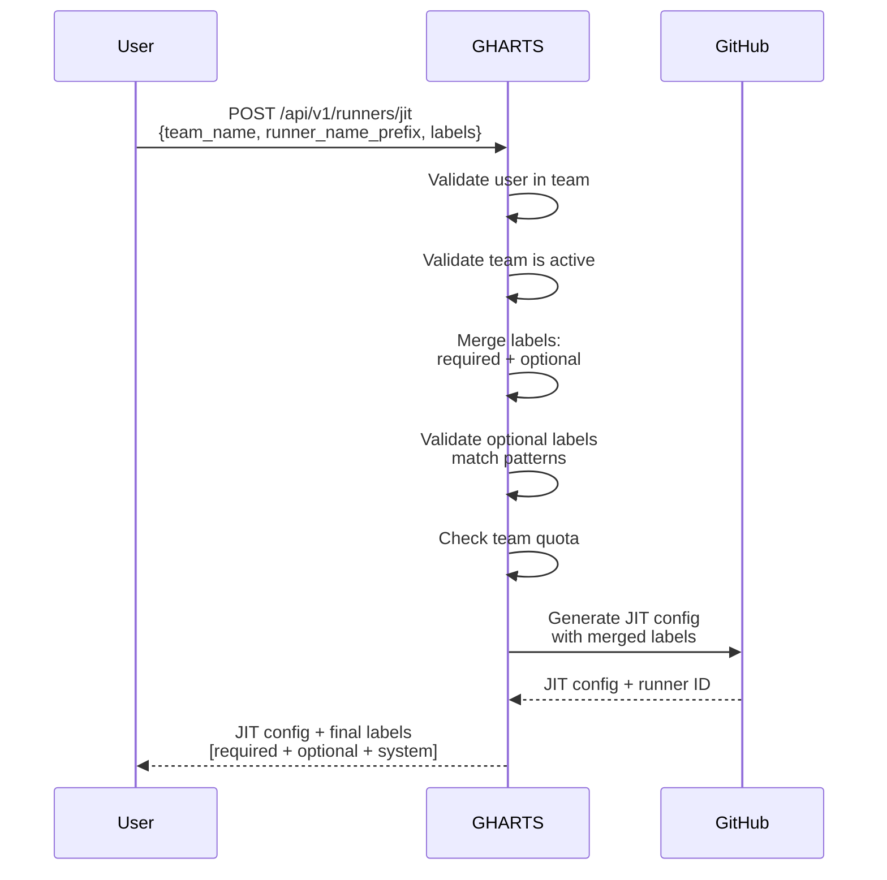

# Team-Based Authorization Design

## Executive Summary

This document describes the design for migrating GHARTS from user-based to team-based authorization. The current system associates label policies and quotas with individual users by email. The new design introduces teams as first-class entities, allowing groups of users to share runner pools with common label policies and quotas.

### Key Changes

1. **Teams as Primary Authorization Unit**: Teams define label policies, quotas, and runner access
2. **User-Team Membership**: Users belong to one or more teams
3. **Team-Scoped JIT Provisioning**: Users specify team when provisioning runners
4. **Team Deactivation**: Teams can be deactivated without affecting user accounts
5. **Clean Implementation**: No production data means straightforward implementation without migration complexity

---

## Current State Analysis

### Current Authorization Model

- **Label Policies**: Associated with individual users via `user_identity` (email)
- **Quota Enforcement**: Per-user runner limits
- **API Access**: Users provision runners with their own label policies
- **Data Model**: [`LabelPolicy`](../../app/models.py:131) table with `user_identity` as primary key

### Limitations

1. **No Team Collaboration**: Each user has separate quota and policies
2. **Management Overhead**: Policies must be duplicated for team members
3. **No Shared Responsibility**: Cannot track team-level resource usage
4. **Inflexible Deactivation**: Deactivating a user affects all their runners

---

## Proposed Architecture

### High-Level Design

```
┌─────────────────────────────────────────────────────────────┐
│                         User Layer                           │
│  ┌──────────┐  ┌──────────┐  ┌──────────┐  ┌──────────┐   │
│  │ User A   │  │ User B   │  │ User C   │  │ User D   │   │
│  └────┬─────┘  └────┬─────┘  └────┬─────┘  └────┬─────┘   │
│       │             │              │             │          │
└───────┼─────────────┼──────────────┼─────────────┼──────────┘
        │             │              │             │
        │   ┌─────────┴──────┐       │   ┌─────────┴──────┐
        │   │                │       │   │                │
        ▼   ▼                ▼       ▼   ▼                ▼
┌─────────────────────┐  ┌─────────────────────┐  ┌─────────────────────┐
│   Team: Backend     │  │   Team: Frontend    │  │   Team: ML          │
│                     │  │                     │  │                     │
│ Required Labels:    │  │ Required Labels:    │  │ Required Labels:    │
│  - backend          │  │  - frontend         │  │  - ml               │
│  - linux            │  │  - linux            │  │  - gpu              │
│                     │  │                     │  │                     │
│ Optional Patterns:  │  │ Optional Patterns:  │  │ Optional Patterns:  │
│  - backend-.*       │  │  - frontend-.*      │  │  - ml-.*            │
│  - dev-.*           │  │  - staging-.*       │  │  - cuda-.*          │
│                     │  │                     │  │                     │
│ Max Runners: 20     │  │ Max Runners: 15     │  │ Max Runners: 5      │
│ Status: Active      │  │ Status: Active      │  │ Status: Active      │
└─────────────────────┘  └─────────────────────┘  └─────────────────────┘
```

### Team-Based JIT Provisioning Flow



---

## Data Model Changes

### New Tables

#### 1. Teams Table

```sql
CREATE TABLE teams (
    id VARCHAR PRIMARY KEY DEFAULT uuid_generate_v4(),
    name VARCHAR NOT NULL UNIQUE,
    description TEXT,
    
    -- Label Policy
    required_labels TEXT NOT NULL,        -- JSON array: always included
    optional_label_patterns TEXT,         -- JSON array: regex patterns
    
    -- Quota
    max_runners INTEGER,                  -- Team-wide quota
    
    -- Status
    is_active BOOLEAN NOT NULL DEFAULT TRUE,
    deactivation_reason TEXT,             -- Required when is_active=false
    deactivated_at TIMESTAMP,
    deactivated_by VARCHAR,               -- Admin who deactivated
    
    -- Metadata
    created_at TIMESTAMP NOT NULL DEFAULT NOW(),
    updated_at TIMESTAMP NOT NULL DEFAULT NOW(),
    created_by VARCHAR,                   -- Admin who created team
    
    -- Indexes
    INDEX idx_teams_name (name),
    INDEX idx_teams_active (is_active),
    
    -- Constraints
    UNIQUE (name),
    CHECK (name ~ '^[a-z0-9][a-z0-9-]*[a-z0-9]$')  -- kebab-case names
);
```

**Design Notes:**
- `name`: Globally unique team identifier (e.g., "backend-team", "ml-platform")
- `required_labels`: Always added to runner provisioning requests
- `optional_label_patterns`: User can specify labels matching these patterns
- Team names must be kebab-case for consistency

#### 2. User-Team Membership Table

```sql
CREATE TABLE user_team_memberships (
    id VARCHAR PRIMARY KEY DEFAULT uuid_generate_v4(),
    user_id VARCHAR NOT NULL REFERENCES users(id) ON DELETE CASCADE,
    team_id VARCHAR NOT NULL REFERENCES teams(id) ON DELETE CASCADE,
    
    -- Membership metadata
    joined_at TIMESTAMP NOT NULL DEFAULT NOW(),
    added_by VARCHAR,                     -- Admin who added user to team
    
    -- Indexes
    INDEX idx_user_team_user (user_id),
    INDEX idx_user_team_team (team_id),
    
    -- Constraints
    UNIQUE (user_id, team_id)
);
```

**Design Notes:**
- Many-to-many relationship: users can belong to multiple teams
- Cascade delete: removing user removes all memberships

### Modified Tables

#### 3. Runners Table (Updated)

```sql
ALTER TABLE runners ADD COLUMN team_id VARCHAR REFERENCES teams(id);
ALTER TABLE runners ADD COLUMN team_name VARCHAR;  -- Denormalized for queries

CREATE INDEX idx_runners_team ON runners(team_id);
CREATE INDEX idx_runners_team_status ON runners(team_id, status);
```

**Migration Strategy:**
- Existing runners: `team_id` and `team_name` will be NULL
- New runners: Always associated with a team

#### 4. LabelPolicy Table (To Be Replaced)

The existing [`LabelPolicy`](../../app/models.py:131) table will be replaced by the team-based model. Since GHARTS has no production data yet, the transition will be straightforward:

1. Implement team-based authorization
2. Update all code to use teams instead of label policies
3. Remove the `LabelPolicy` table and related code

### Data Model Diagram

```
┌─────────────────────┐
│      Users          │
│  ─────────────────  │
│  id (PK)            │
│  email              │
│  oidc_sub           │
│  is_admin           │
│  is_active          │
└──────────┬──────────┘
           │
           │ 1:N
           │
           ▼
┌─────────────────────────┐         ┌─────────────────────┐
│ UserTeamMemberships     │   N:1   │      Teams          │
│  ───────────────────    │────────>│  ─────────────────  │
│  id (PK)                │         │  id (PK)            │
│  user_id (FK)           │         │  name (UNIQUE)      │
│  team_id (FK)           │         │  description        │
│  joined_at              │         │  required_labels    │
└─────────────────────────┘         │  optional_patterns  │
                                    │  max_runners        │
                                    │  is_active          │
                                    │  deactivation_*     │
                                    └──────────┬──────────┘
                                               │
                                               │ 1:N
                                               │
                                               ▼
                                    ┌─────────────────────┐
                                    │      Runners        │
                                    │  ─────────────────  │
                                    │  id (PK)            │
                                    │  runner_name        │
                                    │  team_id (FK)       │
                                    │  team_name          │
                                    │  provisioned_by     │
                                    │  labels             │
                                    │  status             │
                                    └─────────────────────┘
```

---

## API Changes

### 1. Team Management APIs (Admin Only)

#### Create Team

```http
POST /api/v1/admin/teams
Authorization: Bearer {ADMIN_TOKEN}
Content-Type: application/json

{
  "name": "backend-team",
  "description": "Backend development team",
  "required_labels": ["backend", "linux"],
  "optional_label_patterns": ["backend-.*", "dev-.*", "staging-.*"],
  "max_runners": 20
}
```

**Response (201 Created):**
```json
{
  "id": "team-uuid",
  "name": "backend-team",
  "description": "Backend development team",
  "required_labels": ["backend", "linux"],
  "optional_label_patterns": ["backend-.*", "dev-.*", "staging-.*"],
  "max_runners": 20,
  "is_active": true,
  "created_at": "2026-01-28T10:00:00Z",
  "created_by": "admin@example.com"
}
```

#### List Teams

```http
GET /api/v1/admin/teams?is_active=true&limit=50&offset=0
Authorization: Bearer {ADMIN_TOKEN}
```

**Response:**
```json
{
  "teams": [
    {
      "id": "team-uuid",
      "name": "backend-team",
      "description": "Backend development team",
      "required_labels": ["backend", "linux"],
      "optional_label_patterns": ["backend-.*", "dev-.*"],
      "max_runners": 20,
      "is_active": true,
      "member_count": 5,
      "active_runner_count": 12,
      "created_at": "2026-01-28T10:00:00Z"
    }
  ],
  "total": 1
}
```

#### Update Team

```http
PUT /api/v1/admin/teams/{team_id}
Authorization: Bearer {ADMIN_TOKEN}
Content-Type: application/json

{
  "description": "Updated description",
  "required_labels": ["backend", "linux", "docker"],
  "optional_label_patterns": ["backend-.*", "dev-.*", "staging-.*", "prod-.*"],
  "max_runners": 25
}
```

#### Deactivate Team

```http
POST /api/v1/admin/teams/{team_id}/deactivate
Authorization: Bearer {ADMIN_TOKEN}
Content-Type: application/json

{
  "reason": "Team restructuring - migrating to new team structure"
}
```

**Response:**
```json
{
  "id": "team-uuid",
  "name": "backend-team",
  "is_active": false,
  "deactivation_reason": "Team restructuring - migrating to new team structure",
  "deactivated_at": "2026-01-28T10:30:00Z",
  "deactivated_by": "admin@example.com"
}
```

#### Bulk Deactivate Teams

```http
POST /api/v1/admin/teams/bulk-deactivate
Authorization: Bearer {ADMIN_TOKEN}
Content-Type: application/json

{
  "team_ids": ["team-uuid-1", "team-uuid-2"],
  "reason": "Organizational restructuring"
}
```

**Response:**
```json
{
  "success": true,
  "affected_count": 2,
  "failed_count": 0,
  "reason": "Organizational restructuring",
  "details": [
    {
      "team_id": "team-uuid-1",
      "team_name": "backend-team",
      "success": true
    },
    {
      "team_id": "team-uuid-2",
      "team_name": "frontend-team",
      "success": true
    }
  ]
}
```

#### Reactivate Team

```http
POST /api/v1/admin/teams/{team_id}/reactivate
Authorization: Bearer {ADMIN_TOKEN}
```

### 2. User-Team Membership APIs (Admin Only)

#### Add User to Team

```http
POST /api/v1/admin/teams/{team_id}/members
Authorization: Bearer {ADMIN_TOKEN}
Content-Type: application/json

{
  "user_id": "user-uuid"
}
```

#### Remove User from Team

```http
DELETE /api/v1/admin/teams/{team_id}/members/{user_id}
Authorization: Bearer {ADMIN_TOKEN}
```

#### List Team Members

```http
GET /api/v1/admin/teams/{team_id}/members
Authorization: Bearer {ADMIN_TOKEN}
```

**Response:**
```json
{
  "members": [
    {
      "user_id": "user-uuid",
      "email": "alice@example.com",
      "display_name": "Alice Smith",
      "joined_at": "2026-01-28T10:00:00Z",
      "active_runner_count": 3
    }
  ],
  "total": 1
}
```

#### List User's Teams

```http
GET /api/v1/admin/users/{user_id}/teams
Authorization: Bearer {ADMIN_TOKEN}
```

### 3. Updated JIT Provisioning API

#### POST /api/v1/runners/jit (Updated)

**Request:**
```json
{
  "team_name": "backend-team",
  "runner_name_prefix": "worker",
  "labels": ["dev-server", "docker"],
  "runner_group_id": 1,
  "work_folder": "_work"
}
```

**Validation Rules:**

1. **Team Membership**: User must belong to the specified team
   - Error (403): `"User not authorized for team 'backend-team'"`

2. **Team Active**: Team must be active (`is_active = true`)
   - Error (403): `"Team 'backend-team' is deactivated: {reason}"`

3. **Label Validation**: User-provided labels must match optional patterns
   - Required labels are automatically added
   - User-provided labels matching required labels are ignored (no error)
   - User-provided labels not matching optional patterns are rejected
   - Error (403): `"Label 'invalid-label' not permitted. Allowed patterns: ['backend-.*', 'dev-.*']"`

4. **Team Quota**: Team's active runner count must be below `max_runners`
   - Error (429): `"Team quota exceeded. Maximum: 20, current: 20"`

**Response (201 Created):**
```json
{
  "runner_id": "runner-uuid",
  "runner_name": "worker-a1b2c3",
  "team_name": "backend-team",
  "encoded_jit_config": "base64-encoded-config...",
  "labels": ["self-hosted", "linux", "x64", "backend", "linux", "dev-server", "docker"],
  "expires_at": "2026-01-28T11:00:00Z",
  "run_command": "./run.sh --jitconfig <encoded_jit_config>"
}
```

**Label Merging Logic:**
```python
# Team: backend-team
# Required: ["backend", "linux"]
# Optional patterns: ["backend-.*", "dev-.*", "staging-.*"]

# User request: ["dev-server", "docker", "backend"]
# Result:
#   - "backend" (required) - user duplicate ignored
#   - "linux" (required) - added automatically
#   - "dev-server" (optional) - matches "dev-.*" pattern ✓
#   - "docker" (optional) - does NOT match any pattern ✗ REJECTED

# Final labels sent to GitHub:
# ["backend", "linux", "dev-server"] + system labels
```

### 4. User-Facing Team APIs

#### List My Teams

```http
GET /api/v1/teams
Authorization: Bearer {USER_TOKEN}
```

**Response:**
```json
{
  "teams": [
    {
      "id": "team-uuid",
      "name": "backend-team",
      "description": "Backend development team",
      "required_labels": ["backend", "linux"],
      "optional_label_patterns": ["backend-.*", "dev-.*"],
      "max_runners": 20,
      "my_active_runners": 3,
      "team_active_runners": 12,
      "is_active": true
    }
  ],
  "total": 1
}
```

#### Get Team Details

```http
GET /api/v1/teams/{team_name}
Authorization: Bearer {USER_TOKEN}
```

---

## API Rules Summary

### JIT Provisioning with Teams

When a user provisions a runner using [`/api/v1/runners/jit`](../../app/api/v1/runners.py:78), the following rules apply:

1. **Team Specification Required**
   - The `team_name` parameter is mandatory
   - The team must exist in the system

2. **Team Membership Validation**
   - User must be a member of the specified team
   - Returns `403 Forbidden` if user is not a team member
   - Error message: `"User not authorized for team '{team_name}'"`

3. **Team Status Validation**
   - Team must be active (`is_active = true`)
   - Returns `403 Forbidden` if team is deactivated
   - Error message: `"Team '{team_name}' is deactivated: {deactivation_reason}"`

4. **Label Composition**
   - **Required Labels**: Automatically added to all runners (e.g., `["backend", "linux"]`)
   - **Optional Labels**: User may specify labels matching optional patterns
   - **System Labels**: Added by GitHub (e.g., `["self-hosted", "linux", "x64"]`)

5. **Label Validation Rules**
   - User-provided labels must match at least one optional label pattern
   - User-provided labels that duplicate required labels are silently ignored (not an error)
   - User-provided labels that don't match any pattern are rejected
   - Returns `403 Forbidden` with list of invalid labels
   - Error message: `"Labels {invalid_labels} not permitted. Allowed patterns: {patterns}"`

6. **Team Quota Enforcement**
   - Team's active runner count must be below `max_runners`
   - Active runners include: `status IN ('pending', 'active', 'offline')`
   - Returns `429 Too Many Requests` if quota exceeded
   - Error message: `"Team quota exceeded. Maximum: {max}, current: {count}"`

7. **Multi-Team Users**
   - Users belonging to multiple teams can provision runners for any of their teams
   - Each team has independent quota and label policies
   - If one team is deactivated, user can still use other active teams

8. **Deactivated Team Behavior**
   - Users cannot provision new runners for deactivated teams
   - Existing runners from deactivated teams continue to function
   - Deactivation does not affect user's ability to use other teams
   - Deactivation reason is included in error messages for transparency

---

## Frontend UI Changes

### 1. Admin Console - Team Management

#### Teams List Page (`/admin/teams`)

**Key Features:**
- List all teams with filtering by status
- Show member count and active runner count
- Quick actions: Edit, Deactivate, View Members
- Bulk operations support

#### Create/Edit Team Modal

**Fields:**
- Team Name (kebab-case validation)
- Description
- Required Labels (chip input)
- Optional Label Patterns (chip input with regex validation)
- Max Runners (optional)

#### Team Members Management

**Features:**
- List all team members
- Show per-user active runner count
- Add/remove members
- Search and filter members

### 2. Admin Console - User Management (Updated)

#### User Detail Page - Teams Tab

**Features:**
- List all teams user belongs to
- Show per-team active runner count
- Add user to additional teams
- Remove user from teams

### 3. User Dashboard - Provision Runner (Updated)

#### Team Selection

**Features:**
- Radio button selection of user's teams
- Display team's required labels and optional patterns
- Show current quota usage (e.g., "12/20 runners active")
- Disable deactivated teams with reason

#### Label Input

**Features:**
- Only allow input of optional labels
- Real-time validation against team's patterns
- Show which labels will be included (required + optional + system)
- Clear error messages for invalid labels

### 4. User Dashboard - My Teams Page (New)

**Features:**
- Card-based display of user's teams
- Show team details, quota, and labels
- Quick link to provision runner for each team
- Indicate deactivated teams

---

## Implementation Strategy

Since GHARTS has no production data yet, the implementation can be straightforward:

### Phase 1: Implementation

1. **Create New Tables**
   ```sql
   CREATE TABLE teams (...);
   CREATE TABLE user_team_memberships (...);
   ALTER TABLE runners ADD COLUMN team_id VARCHAR;
   ALTER TABLE runners ADD COLUMN team_name VARCHAR;
   ```

2. **Implement Team-Based Authorization**
   - Create team models and services
   - Update JIT provisioning API to require `team_name`
   - Add team management APIs
   - Update frontend UI

3. **Remove Label Policy Code**
   - Drop [`label_policies`](../../app/models.py:131) table
   - Remove label policy service and endpoints
   - Update all references to use teams

### Phase 2: Testing & Documentation

1. **Comprehensive Testing**
   - Unit tests for team logic
   - Integration tests for JIT with teams
   - E2E tests for admin and user workflows

2. **Documentation Updates**
   - Update all design documents
   - Create team management guide
   - Update API documentation
   - Add usage examples

### Phase 3: Deployment

1. **Deploy to Staging**
   - Validate all functionality
   - Performance testing
   - Security review

2. **Deploy to Production**
   - Monitor error rates and latency
   - Gather user feedback
   - Iterate based on feedback

---

## Testing Strategy

### Unit Tests

1. **Team Model Tests**
   - Team creation with valid/invalid names
   - Team deactivation/reactivation
   - Team quota enforcement

2. **User-Team Membership Tests**
   - Add/remove user from team
   - User belongs to multiple teams
   - Cascade delete behavior

3. **Label Validation Tests**
   - Required labels always included
   - Optional labels match patterns
   - Invalid labels rejected
   - Duplicate required labels ignored

### Integration Tests

1. **JIT Provisioning with Teams**
   - User provisions runner for their team
   - User attempts to use team they don't belong to (403)
   - User attempts to use deactivated team (403)
   - Invalid optional labels rejected (403)
   - Team quota exceeded (429)

2. **Multi-Team Scenarios**
   - User belongs to 2 teams, provisions for each
   - One team deactivated, other still works
   - Different quotas per team

3. **Team Management Tests**
   - Create, update, deactivate teams
   - Add/remove users from teams
   - Verify team quota enforcement

### End-to-End Tests

1. **Admin Workflow**
   - Create team
   - Add users to team
   - User provisions runner
   - Deactivate team
   - User cannot provision for deactivated team

2. **User Workflow**
   - View my teams
   - Select team for provisioning
   - Specify optional labels
   - Receive JIT config with merged labels

---

## Security Considerations

### Authorization

1. **Team Membership Validation**
   - Always verify user belongs to team before provisioning
   - Cache team memberships with short TTL (5 minutes)
   - Invalidate cache on membership changes

2. **Team Status Validation**
   - Check team is active before provisioning
   - Include deactivation reason in error messages
   - Log security events for deactivated team access attempts

3. **Label Policy Enforcement**
   - Required labels cannot be overridden
   - Optional labels must match patterns
   - System labels excluded from validation

### Audit Trail

1. **Team Operations**
   - Log team creation/updates/deactivation
   - Log user additions/removals
   - Include admin identity in all operations

2. **Runner Provisioning**
   - Log team name in audit events
   - Track which team's quota was used
   - Link runners to teams for reporting

### Quota Management

1. **Team-Level Quotas**
   - Enforce at provisioning time
   - Count active runners per team
   - Prevent quota bypass via multiple teams

2. **User-Level Tracking**
   - Track runners per user per team
   - Enable per-user limits within teams (future)

---

## Performance Considerations

### Database Queries

1. **Team Membership Lookup**
   ```sql
   -- Optimized query with indexes
   SELECT t.* FROM teams t
   JOIN user_team_memberships utm ON t.id = utm.team_id
   WHERE utm.user_id = ? AND t.is_active = true
   ```

2. **Team Quota Check**
   ```sql
   -- Count active runners for team
   SELECT COUNT(*) FROM runners
   WHERE team_id = ? AND status IN ('pending', 'active', 'offline')
   ```

3. **Indexes Required**
   - `idx_user_team_user` on `user_team_memberships(user_id)`
   - `idx_runners_team_status` on `runners(team_id, status)`
   - `idx_teams_active` on `teams(is_active)`

### Caching Strategy

1. **Team Membership Cache**
   - Cache user's teams for 5 minutes
   - Invalidate on membership changes
   - Use Redis or in-memory cache

2. **Team Details Cache**
   - Cache team label policies for 5 minutes
   - Invalidate on team updates
   - Reduces database load

### API Performance

1. **Provisioning Latency**
   - Team validation: +5-10ms (cached)
   - Label merging: +1-2ms (in-memory)
   - Total overhead: ~10-15ms

2. **List Operations**
   - Paginate team lists (default 50)
   - Eager load member counts
   - Use database aggregations

---

## Documentation Updates

### 1. Update [`arc.md`](arc.md)

Add section on team-based authorization:
- Team architecture diagram
- Team-based JIT flow
- Transition from user-based to team-based authorization

### 2. Update [`api_contract.md`](../api_contract.md)

Document new endpoints:
- Team management APIs
- Updated JIT provisioning API
- User-team membership APIs

### 3. Update [`jit_provisioning.md`](jit_provisioning.md)

Add team-based provisioning:
- Team parameter requirement
- Label merging logic
- Team validation rules

### 4. Create `team_management.md`

New document covering:
- Team concepts and design
- Admin workflows
- User workflows
- Best practices

### 5. Update [`USAGE_EXAMPLES.md`](../USAGE_EXAMPLES.md)

Add examples:
- Creating teams
- Adding users to teams
- Provisioning with teams
- Handling deactivated teams

---

## Rollout Plan

### Week 1-2: Development

- [ ] Create database schema for teams
- [ ] Implement team models and services
- [ ] Update JIT provisioning API with team requirement
- [ ] Add team management APIs
- [ ] Remove label policy code

### Week 3: Frontend Development

- [ ] Create team management UI
- [ ] Update provision runner page
- [ ] Add "My Teams" page
- [ ] Update admin console

### Week 4: Testing

- [ ] Unit tests for team logic
- [ ] Integration tests for JIT with teams
- [ ] End-to-end admin workflows
- [ ] Performance testing

### Week 5: Documentation

- [ ] Update all design documents
- [ ] Create team management guide
- [ ] Update API documentation
- [ ] Create usage examples

### Week 6: Staging Deployment

- [ ] Deploy to staging environment
- [ ] Validate all functionality
- [ ] Performance testing with load
- [ ] Security review

### Week 7: Production Rollout

- [ ] Deploy to production
- [ ] Monitor error rates and latency
- [ ] Gather user feedback
- [ ] Address any issues

### Week 8: Iteration

- [ ] Implement feedback
- [ ] Optimize performance
- [ ] Enhance documentation
- [ ] Plan future enhancements

---

## Success Metrics

### Adoption Metrics

- % of runners provisioned via team-based API
- Number of teams created
- Average team size (members)
- Average runners per team

### Performance Metrics

- JIT provisioning latency (p50, p95, p99)
- Team validation cache hit rate
- Database query performance
- API error rates

### User Experience Metrics

- Time to provision runner (team vs user-based)
- Number of provisioning errors
- User feedback scores
- Support ticket volume

---

## Appendix A: Example Scenarios

### Scenario 1: Backend Team

**Setup:**
- Team: `backend-team`
- Required labels: `["backend", "linux"]`
- Optional patterns: `["backend-.*", "dev-.*", "staging-.*"]`
- Max runners: 20
- Members: Alice, Bob, Charlie

**User Request (Alice):**
```json
{
  "team_name": "backend-team",
  "runner_name_prefix": "worker",
  "labels": ["dev-server", "docker"]
}
```

**Validation:**
- ✓ Alice is member of backend-team
- ✓ backend-team is active
- ✓ "dev-server" matches "dev-.*" pattern
- ✗ "docker" does NOT match any pattern → **REJECTED**

**Error Response:**
```json
{
  "detail": "Labels ['docker'] not permitted. Allowed patterns: ['backend-.*', 'dev-.*', 'staging-.*']",
  "error_code": "LABEL_POLICY_VIOLATION"
}
```

### Scenario 2: Multi-Team User

**Setup:**
- User: Alice
- Teams: `backend-team`, `frontend-team`

**Request 1 (backend-team):**
```json
{
  "team_name": "backend-team",
  "runner_name_prefix": "api-worker",
  "labels": ["backend-api", "dev-env"]
}
```

**Result:**
- ✓ Labels: `["backend", "linux", "backend-api", "dev-env"]`
- ✓ Quota: backend-team 13/20

**Request 2 (frontend-team):**
```json
{
  "team_name": "frontend-team",
  "runner_name_prefix": "ui-worker",
  "labels": ["frontend-react", "staging-env"]
}
```

**Result:**
- ✓ Labels: `["frontend", "linux", "frontend-react", "staging-env"]`
- ✓ Quota: frontend-team 9/15

### Scenario 3: Deactivated Team

**Setup:**
- Team: `ml-platform`
- Status: Deactivated
- Reason: "Team restructuring - migrating to ml-core team"

**User Request:**
```json
{
  "team_name": "ml-platform",
  "runner_name_prefix": "gpu-worker",
  "labels": ["ml-training"]
}
```

**Error Response (403):**
```json
{
  "detail": "Team 'ml-platform' is deactivated: Team restructuring - migrating to ml-core team",
  "error_code": "TEAM_DEACTIVATED"
}
```

---

## Appendix B: Implementation Checklist

### Backend Changes

- [ ] Create [`Team`](../../app/models.py) model
- [ ] Create [`UserTeamMembership`](../../app/models.py) model
- [ ] Update [`Runner`](../../app/models.py:16) model with team fields
- [ ] Create team service layer
- [ ] Update [`JitProvisionRequest`](../../app/schemas.py:260) schema with `team_name`
- [ ] Update [`provision_runner_jit()`](../../app/api/v1/runners.py:83) with team validation
- [ ] Add team management endpoints
- [ ] Add user-team membership endpoints
- [ ] Remove label policy code
- [ ] Update audit logging

### Frontend Changes

- [ ] Create Teams management page
- [ ] Create Team detail/edit modal
- [ ] Create Team members management
- [ ] Update User management with teams tab
- [ ] Update Provision Runner page with team selection
- [ ] Create My Teams page
- [ ] Add team-related API hooks
- [ ] Update navigation/sidebar

### Testing

- [ ] Unit tests for team models
- [ ] Unit tests for team service
- [ ] Integration tests for JIT with teams
- [ ] E2E tests for admin workflows
- [ ] E2E tests for user workflows
- [ ] Performance tests

### Documentation

- [ ] Update [`arc.md`](arc.md)
- [ ] Update [`api_contract.md`](../api_contract.md)
- [ ] Update [`jit_provisioning.md`](jit_provisioning.md)
- [ ] Create `team_management.md`
- [ ] Update [`USAGE_EXAMPLES.md`](../USAGE_EXAMPLES.md)
- [ ] Create team management guide
- [ ] Update README

---

## Conclusion

This design introduces team-based authorization to GHARTS, enabling collaborative runner management with shared quotas and label policies. Since GHARTS has no production data yet, the implementation can proceed directly without migration concerns. The design prioritizes security, performance, and user experience, with comprehensive testing and documentation to support successful adoption.

**Next Steps:**
1. Review and approve this design document
2. Create detailed implementation tasks
3. Begin Phase 1 development
4. Schedule regular check-ins during rollout
