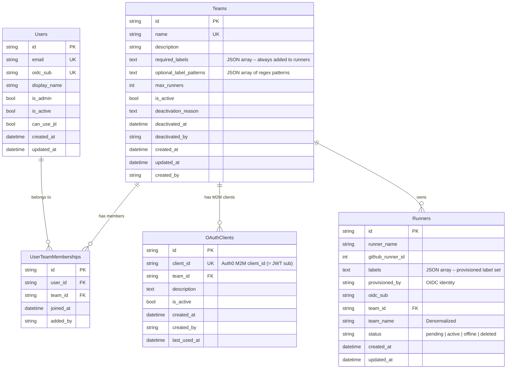
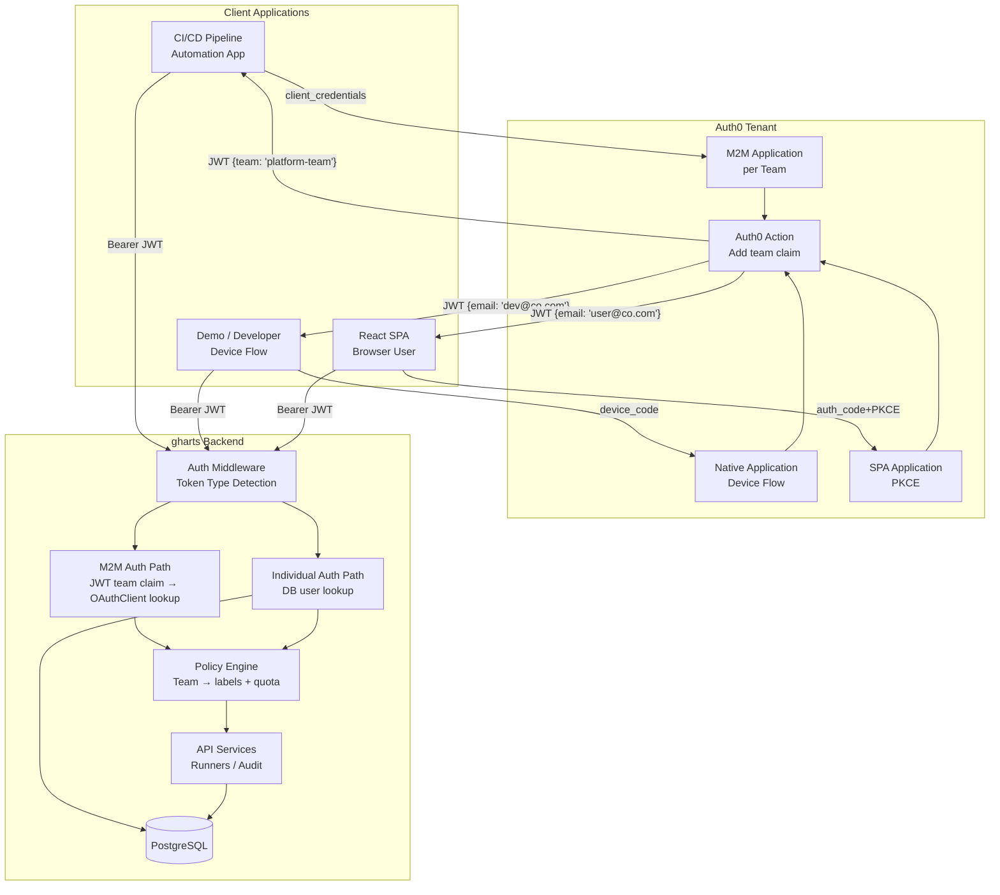
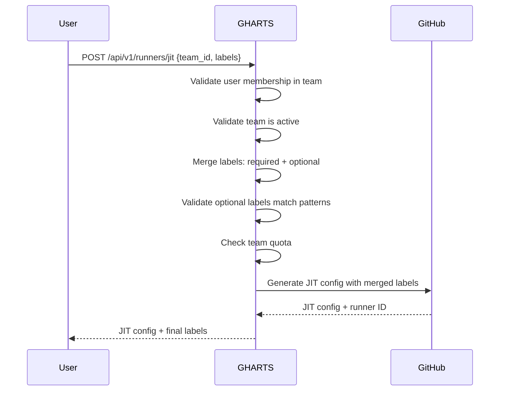

# Team-Based Authorization Design

## Overview

Teams are the primary authorization unit. Users belong to one or more teams. Each team defines label policies, runner quotas, and M2M credentials. Label policy is embedded directly in the team — there is no separate `label_policies` table.

---

## Data Model

```mermaid
erDiagram
    Users {
        string id PK
        string email UK
        string oidc_sub UK
        string display_name
        bool   is_admin
        bool   is_active
        bool   can_use_jit
        datetime created_at
        datetime updated_at
    }

    Teams {
        string   id PK
        string   name UK
        string   description
        text     required_labels         "JSON array – always added to runners"
        text     optional_label_patterns "JSON array of regex patterns"
        int      max_runners
        bool     is_active
        text     deactivation_reason
        datetime deactivated_at
        string   deactivated_by
        datetime created_at
        datetime updated_at
        string   created_by
    }

    UserTeamMemberships {
        string   id PK
        string   user_id FK
        string   team_id FK
        datetime joined_at
        string   added_by
    }

    OAuthClients {
        string   id PK
        string   client_id UK          "Auth0 M2M client_id (= JWT sub)"
        string   team_id FK
        text     description
        bool     is_active
        datetime created_at
        string   created_by
        datetime last_used_at
    }

    Runners {
        string   id PK
        string   runner_name
        int      github_runner_id
        text     labels               "JSON array – provisioned label set"
        string   provisioned_by       "OIDC identity"
        string   oidc_sub
        string   team_id FK
        string   team_name            "Denormalized"
        string   status               "pending | active | offline | deleted"
        datetime created_at
        datetime updated_at
    }

    Users ||--o{ UserTeamMemberships : "belongs to"
    Teams ||--o{ UserTeamMemberships : "has members"
    Teams ||--o{ OAuthClients        : "has M2M clients"
    Teams ||--o{ Runners             : "owns"
```

---

## Architecture

```mermaid
graph TB
    subgraph "Client Applications"
        APP[CI/CD Pipeline<br/>Automation App]
        DEMO[Demo / Developer<br/>Device Flow]
        SPA[React SPA<br/>Browser User]
    end

    subgraph "Auth0 Tenant"
        M2M[M2M Application<br/>per Team]
        NATIVE[Native Application<br/>Device Flow]
        SPA_APP[SPA Application<br/>PKCE]
        ACTION[Auth0 Action<br/>Add team claim]
    end

    subgraph "gharts Backend"
        AUTH[Auth Middleware<br/>Token Type Detection]
        TEAM_AUTH[M2M Auth Path<br/>JWT team claim → OAuthClient lookup]
        IND_AUTH[Individual Auth Path<br/>DB user lookup]
        POLICY[Policy Engine<br/>Team → labels + quota]
        API_SVC[API Services<br/>Runners / Audit]
        DB[(PostgreSQL)]
    end

    APP -->|client_credentials| M2M
    DEMO -->|device_code| NATIVE
    SPA -->|auth_code+PKCE| SPA_APP

    M2M --> ACTION
    NATIVE --> ACTION
    SPA_APP --> ACTION

    ACTION -->|"JWT {team: 'platform-team'}"| APP
    ACTION -->|"JWT {email: 'dev@co.com'}"| DEMO
    ACTION -->|"JWT {email: 'user@co.com'}"| SPA

    APP -->|Bearer JWT| AUTH
    DEMO -->|Bearer JWT| AUTH
    SPA -->|Bearer JWT| AUTH

    AUTH --> TEAM_AUTH
    AUTH --> IND_AUTH

    TEAM_AUTH --> POLICY
    IND_AUTH --> DB
    IND_AUTH --> POLICY

    POLICY --> API_SVC
    API_SVC --> DB
```

---

## Token Type Detection

The backend distinguishes two JWT shapes:

| Claim present | Token type | Auth path |
|---|---|---|
| `gty: client-credentials` | M2M / team credential | OAuthClient lookup → team |
| `email` or `sub` only | Individual OIDC | User DB lookup → team memberships |

---

## JIT Provisioning Flow

```mermaid
sequenceDiagram
    participant User
    participant GHARTS
    participant GitHub

    User->>GHARTS: POST /api/v1/runners/jit {team_id, labels}
    GHARTS->>GHARTS: Validate user membership in team
    GHARTS->>GHARTS: Validate team is active
    GHARTS->>GHARTS: Merge labels: required + optional
    GHARTS->>GHARTS: Validate optional labels match patterns
    GHARTS->>GHARTS: Check team quota
    GHARTS->>GitHub: Generate JIT config with merged labels
    GitHub-->>GHARTS: JIT config + runner ID
    GHARTS-->>User: JIT config + final labels
```

---

## Architecture Decisions

### ADR-1: Explicit OAuthClient Registration Required

**Decision:** Every M2M token must be backed by an `OAuthClient` row. M2M access is rejected if the record does not exist or is inactive, even if the `team` JWT claim is valid.

**Rationale:**

1. **Audit trail** — `OAuthClient` records `created_by`, `created_at`, and `last_used_at` on every request. Team name matching alone produces no record of when the credential was provisioned or how actively it is used.
2. **Independent revocation** — An operator can disable a specific M2M client (`is_active = false`) without touching the team, the Auth0 application, or the team's runner policy.
3. **Client ID verification** — The `sub` claim (the Auth0 `client_id`) is matched against the registered `client_id`. This blocks a rogue Auth0 M2M app carrying a valid `team` claim unless its `client_id` has been explicitly allowlisted by an admin.
4. **One-client-per-team enforcement** — At most one active `OAuthClient` per team (HTTP 409 on duplicate). This mirrors the terraform model of exactly one M2M app per team.

**Consequences:** Initial setup requires an extra admin step. Terraform automation should include a `POST /api/v1/admin/oauth-clients` call as part of team provisioning.

---

### ADR-2: Admin Team Cannot Have an M2M Client

**Decision:** The admin team is excluded from M2M client registration. Only human members can hold admin-team membership.

**Rationale:**

1. **Privilege boundary** — M2M clients are for automated runner provisioning. Admin operations are human-governed; allowing M2M credentials to perform them would bypass that safeguard.
2. **Blast-radius containment** — A leaked M2M `client_secret` should be scoped to runner provisioning for one team, not system-wide admin access.
3. **Backend flexibility** — The restriction is enforced in the frontend UI only, leaving the backend open to lifting it in future if a legitimate use-case emerges.
