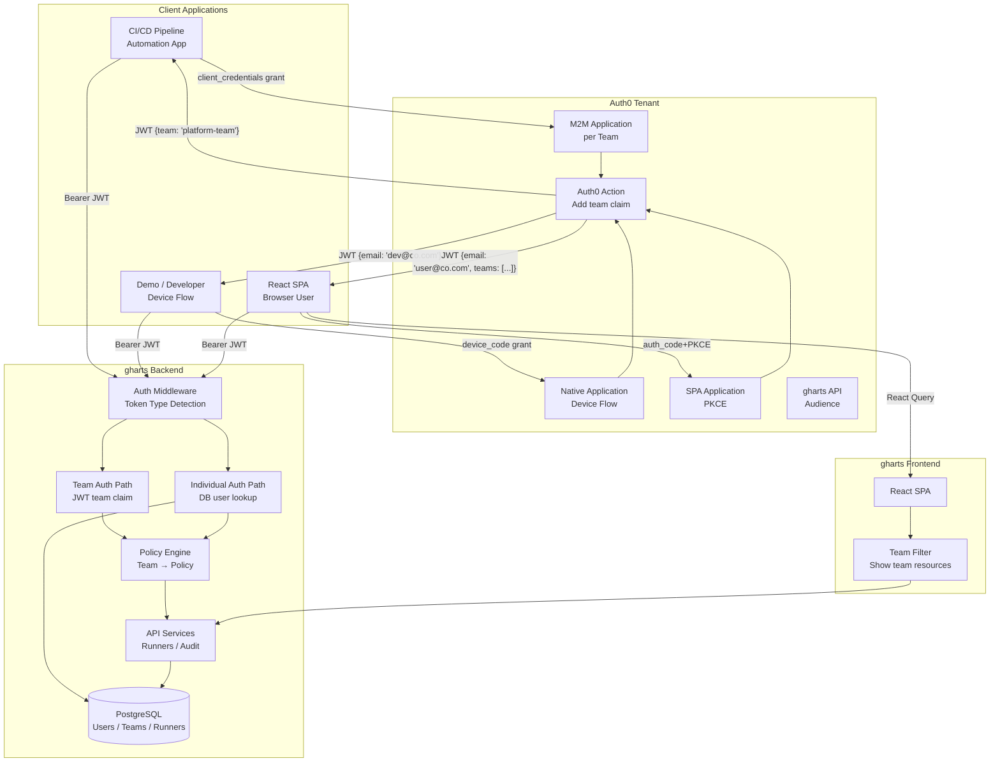
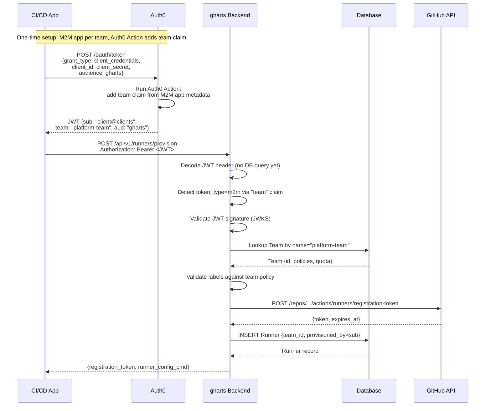
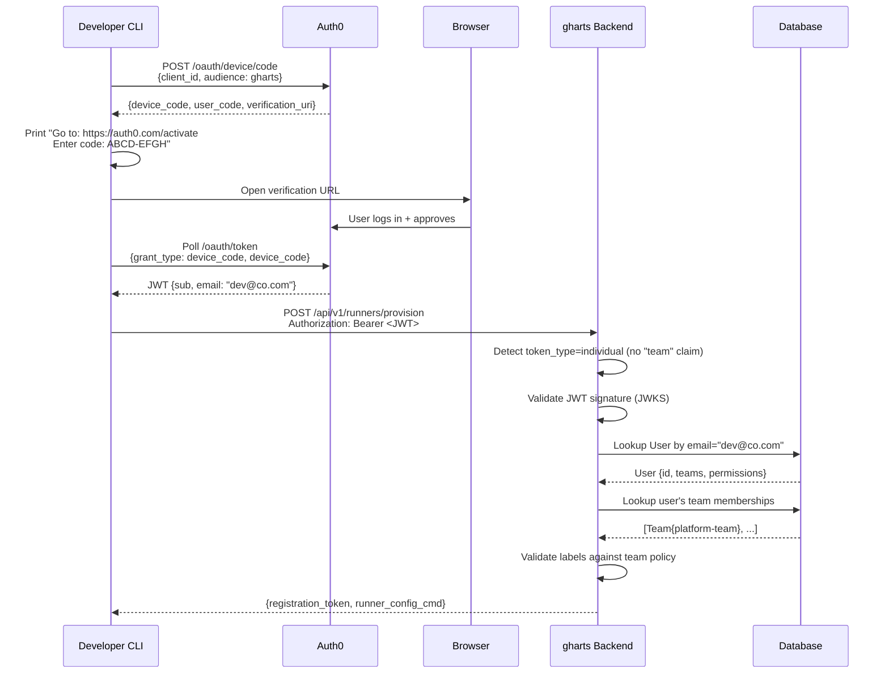
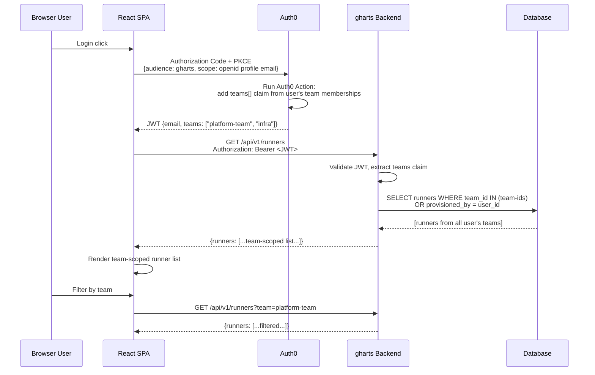

# Team-Level OAuth Credentials Design

## Overview

This document describes the design for introducing team-level OAuth credentials into gharts. The change enables applications (CI pipelines, automation tools) to authenticate using **OAuth client credentials** (machine-to-machine) at a **team level**, embedding the team identity directly into the JWT token. The frontend SPA continues to use OIDC Device/Authorization Code flow, but filtering shifts to team-level visibility.

---

## Goals

1. **M2M authentication at team level**: Applications authenticate to Auth0 using OAuth `client_credentials` grant and receive a JWT containing the team name.
2. **Simplified backend authorization**: The backend derives team context directly from the JWT `team` claim — no DB email-to-team lookup required for M2M tokens.
3. **Backward compatibility for individuals**: Device flow (individual OIDC tokens) continues to work for demos and individual users.
4. **Team-scoped frontend views**: The React SPA shows all resources for the user's teams, including resources from all members of those teams.

---

## Architecture Diagram



---

## Sequence Diagrams

### M2M Application Flow (team credentials)



### Individual Device Flow (backward compatible)



### SPA Frontend Team-Scoped View



---

## Token Type Detection

The backend needs to distinguish between two JWT shapes:

| Claim present | Token type | Auth path |
|---|---|---|
| `team` (string) | M2M / team credential | Direct team lookup by name |
| `email` or `sub` only | Individual OIDC | User DB lookup → team memberships |

```python
# app/auth/token_types.py
from enum import Enum

class TokenType(Enum):
    M2M_TEAM = "m2m_team"       # OAuth client_credentials with team claim
    INDIVIDUAL = "individual"    # OIDC user token (device flow or SPA)

def detect_token_type(claims: dict) -> TokenType:
    """Detect token type from JWT claims."""
    if claims.get("team"):
        return TokenType.M2M_TEAM
    return TokenType.INDIVIDUAL
```

---

## Auth0 Configuration

### M2M Application per Team

Each team gets a dedicated Auth0 M2M application:

```
Auth0 Tenant
├── API: gharts  (audience: "gharts")
├── M2M App: gharts-platform-team
│   ├── client_id, client_secret
│   ├── Grant: client_credentials
│   └── Metadata: {"team": "platform-team"}
├── M2M App: gharts-infra-team
│   └── Metadata: {"team": "infra"}
├── SPA App: gharts-dashboard
│   └── Grant: authorization_code + PKCE
└── Native App: gharts-cli
    └── Grant: device_code
```

### Auth0 Action: Add Team Claim

This Action runs on every token issuance and adds the `team` claim for M2M apps:

```javascript
// Auth0 Action: "Add Team Claim"
// Trigger: Machine to Machine / Post Token

exports.onExecuteCredentialsExchange = async (event, api) => {
  const teamName = event.client.metadata?.team;
  if (teamName) {
    api.accessToken.setCustomClaim("team", teamName);
  }
};
```

For SPA/user tokens, an Action can optionally embed team membership:

```javascript
// Auth0 Action: "Add User Teams"
// Trigger: Login / Post Login

exports.onExecutePostLogin = async (event, api) => {
  // Optionally embed teams in token for frontend use
  // Teams are also fetched via /api/v1/users/me for security
  const teams = event.user.app_metadata?.teams || [];
  if (teams.length > 0) {
    api.idToken.setCustomClaim("teams", teams);
    api.accessToken.setCustomClaim("teams", teams);
  }
};
```

---

## Backend Changes

### Updated `AuthenticatedUser`

```python
# app/auth/dependencies.py

class AuthenticatedUser:
    def __init__(
        self,
        identity: str,
        claims: dict,
        token_type: TokenType,
        db_user: Optional["User"] = None,
        team: Optional["Team"] = None,  # NEW: for M2M tokens
    ):
        self.identity = identity
        self.claims = claims
        self.token_type = token_type
        self.email = claims.get("email")
        self.name = claims.get("name")
        self.sub = claims.get("sub")

        # M2M team context (direct from JWT)
        self.team = team  # Team object when token_type == M2M_TEAM
        self.team_name_from_token = claims.get("team")

        # Individual user context (from DB)
        self.db_user = db_user
        self.user_id = db_user.id if db_user else None
        self.is_admin = db_user.is_admin if db_user else False
        self.is_active = db_user.is_active if db_user else True
        self.can_use_registration_token = (
            db_user.can_use_registration_token if db_user else
            (token_type == TokenType.M2M_TEAM)  # M2M always can provision
        )
        self.can_use_jit = (
            db_user.can_use_jit if db_user else
            (token_type == TokenType.M2M_TEAM)
        )
```

### Updated `get_current_user`

```python
async def get_current_user(
    credentials: Optional[HTTPAuthorizationCredentials] = Security(security),
    settings: Settings = Depends(get_settings),
    db: Session = Depends(get_db),
) -> AuthenticatedUser:
    # ... existing validation ...
    token_type = detect_token_type(payload)

    if token_type == TokenType.M2M_TEAM:
        team_name = payload["team"]
        team = db.query(Team).filter(
            Team.name == team_name,
            Team.is_active == True
        ).first()
        if not team:
            raise HTTPException(
                status_code=status.HTTP_403_FORBIDDEN,
                detail=f"Team '{team_name}' not found or inactive.",
            )
        return AuthenticatedUser(
            identity=f"m2m:{team_name}",
            claims=payload,
            token_type=token_type,
            team=team,
        )

    elif token_type == TokenType.INDIVIDUAL:
        db_user = _find_user_by_claims(db, payload)
        if db_user is None:
            raise HTTPException(status_code=403, detail="User not authorized.")
        return AuthenticatedUser(
            identity=validator.get_user_identity(payload),
            claims=payload,
            token_type=token_type,
            db_user=db_user,
        )
```

### Team Resolution in Runner Service

```python
# app/services/runner_service.py

async def get_team_for_provisioning(
    user: AuthenticatedUser,
    requested_team_id: Optional[str],
    db: Session,
) -> Team:
    """Resolve team for runner provisioning."""
    if user.token_type == TokenType.M2M_TEAM:
        # Team is embedded in JWT — no DB lookup needed
        return user.team

    # Individual path: look up user's team memberships
    if requested_team_id:
        return _get_team_with_membership_check(user, requested_team_id, db)
    return _get_default_team(user, db)
```

---

## Frontend Changes

### Team-Scoped Runner Listing

```typescript
// frontend/src/api/runners.ts

export const listRunners = async (teamFilter?: string): Promise<Runner[]> => {
  const params = teamFilter ? { team: teamFilter } : {};
  const { data } = await apiClient.get('/api/v1/runners', { params });
  return data.runners;
};
```

```typescript
// frontend/src/hooks/useRunners.ts

export const useRunners = (teamFilter?: string) => {
  const { user } = useAuthStore();

  return useQuery({
    queryKey: ['runners', teamFilter ?? 'all'],
    queryFn: () => listRunners(teamFilter),
    // Show runners for all user teams by default
  });
};
```

### Team Context in Sidebar/Navigation

```typescript
// frontend/src/components/TeamSelector.tsx

export const TeamSelector: React.FC = () => {
  const { user } = useAuthStore();
  const [selectedTeam, setSelectedTeam] = useTeamFilter();

  return (
    <Select value={selectedTeam ?? 'all'} onValueChange={setSelectedTeam}>
      <SelectItem value="all">All My Teams</SelectItem>
      {user?.teams?.map(team => (
        <SelectItem key={team.id} value={team.name}>{team.name}</SelectItem>
      ))}
    </Select>
  );
};
```

### Backend Endpoint: Team-Scoped Runner List

```python
# app/api/v1/runners.py

@router.get("/")
async def list_runners(
    team: Optional[str] = Query(None, description="Filter by team name"),
    status: Optional[str] = Query(None),
    user: AuthenticatedUser = Depends(get_current_user),
    db: Session = Depends(get_db),
):
    if user.token_type == TokenType.M2M_TEAM:
        # M2M: only see own team's runners
        query = db.query(Runner).filter(Runner.team_id == user.team.id)
    elif user.is_admin:
        # Admin: see all (optionally filtered)
        query = db.query(Runner)
        if team:
            query = query.filter(Runner.team_name == team)
    else:
        # Individual user: see all runners from their teams
        user_team_ids = [m.team_id for m in get_user_team_memberships(user, db)]
        query = db.query(Runner).filter(
            or_(
                Runner.provisioned_by == user.identity,
                Runner.team_id.in_(user_team_ids)
            )
        )
        if team:
            query = query.filter(Runner.team_name == team)

    return {"runners": query.all()}
```

---

## Database Changes

No schema changes required. The existing `Team` table, `User` table, and `UserTeamMembership` table already support the required model. The M2M token path bypasses user-level DB lookups entirely.

A new `OAuthClient` table is recommended for audit trail purposes:

```python
class OAuthClient(Base):
    """OAuth M2M clients registered for team access."""

    __tablename__ = "oauth_clients"

    id = Column(String, primary_key=True, default=lambda: str(uuid.uuid4()))
    client_id = Column(String, nullable=False, unique=True, index=True)  # Auth0 client ID
    team_id = Column(String, ForeignKey("teams.id"), nullable=False, index=True)
    description = Column(Text, nullable=True)
    is_active = Column(Boolean, default=True, nullable=False)
    created_at = Column(DateTime, nullable=False, default=utcnow)
    created_by = Column(String, nullable=True)
    last_used_at = Column(DateTime, nullable=True)

    __table_args__ = (
        Index("ix_oauth_clients_team", "team_id", "is_active"),
    )
```

---

## Helm / Configuration Changes

New configuration values for Auth0 M2M setup:

```yaml
# helm/gharts/values.yaml (additions)
config:
  auth:
    # Existing OIDC config
    oidc:
      enabled: true
      issuer: "https://your-tenant.auth0.com/"
      audience: "gharts"
      jwksUrl: "https://your-tenant.auth0.com/.well-known/jwks.json"

    # NEW: M2M team credential support
    teamCredentials:
      enabled: true
      # Claim name in JWT that carries the team name
      teamClaim: "team"
      # Whether to require team to exist in DB before accepting M2M tokens
      requireTeamInDB: true
```

---

## Horizontal Scalability Analysis

### Client Application Side

**OAuth Client Credentials (M2M)**

| Concern | Analysis |
|---|---|
| Token caching | Clients **must** cache tokens until near expiry. Auth0 tokens are typically 24h TTL. Clients should use a token cache keyed by `(client_id, audience)`. |
| Concurrent requests | The `client_credentials` grant is stateless — multiple app instances can all request tokens independently without coordination. |
| Token refresh | No refresh tokens in `client_credentials` flow. Clients re-request when expired. At scale, stagger requests (jitter) to avoid thundering herd. |
| Secret rotation | Rotating `client_secret` requires coordinated rollout. Use Auth0's "client secret rotation" feature or store secrets in Vault/AWS Secrets Manager. |
| Scale-out | Each app instance is independent. No shared state. Scales horizontally without friction. |

**Device Flow (individual)**

| Concern | Analysis |
|---|---|
| Interactive | Device flow is interactive (one-time) — not suitable for automated scale-out. Use only for dev/demo. |
| Token caching | Short-lived tokens (1h typical). Refresh tokens available. |
| Scale | Single user, single device. Not a scale concern. |

### gharts Backend Side

**M2M Token Path**

| Concern | Analysis |
|---|---|
| JWKS caching | Current `OIDCValidator._jwks_cache` is an instance variable — **not shared across replicas**. Each replica fetches JWKS independently. This is fine (Auth0 JWKS is rarely-changing), but adds latency on cold start. Add TTL-based expiry. |
| DB lookups for M2M | Only a single `Team` lookup by name (indexed). Very low overhead. No `User` or `UserTeamMembership` queries. **M2M path is significantly lighter than individual path.** |
| Stateless validation | JWT validation is CPU-bound (RSA verify). No distributed lock or coordination needed. All replicas validate independently. |
| Horizontal scale | M2M path scales linearly with replicas — no shared mutable state. |

**Individual Token Path (unchanged)**

| Concern | Analysis |
|---|---|
| DB lookups | User + team membership queries on every request. Can become hot path at scale. Add Redis cache for `(email/sub → user_id + team_ids)` with short TTL. |
| Connection pooling | SQLAlchemy pool shared per-process. Each replica has its own pool. Ensure total `max_connections ≤ PG max_connections`. |

**JWKS Cache Improvement (recommended)**

```python
# app/auth/oidc.py — improved JWKS cache with TTL

import time

class OIDCValidator:
    _jwks_cache: Optional[dict] = None
    _jwks_cached_at: float = 0.0
    _jwks_ttl: float = 3600.0  # 1 hour

    async def _fetch_jwks(self) -> dict:
        now = time.monotonic()
        if self._jwks_cache and (now - self._jwks_cached_at) < self._jwks_ttl:
            return self._jwks_cache
        # Fetch and update cache...
        self._jwks_cached_at = now
```

**At-Scale Recommended Architecture**

```
                    ┌────────────────────────────────────────┐
                    │           Load Balancer (nginx/ALB)     │
                    └──────────────┬─────────────────────────┘
                                   │
              ┌────────────────────┼────────────────────┐
              ▼                    ▼                    ▼
        ┌──────────┐        ┌──────────┐        ┌──────────┐
        │  gharts  │        │  gharts  │        │  gharts  │
        │ replica 1│        │ replica 2│        │ replica N│
        │          │        │          │        │          │
        │ JWKS     │        │ JWKS     │        │ JWKS     │
        │ (local   │        │ (local   │        │ (local   │
        │  cache)  │        │  cache)  │        │  cache)  │
        └──────┬───┘        └──────┬───┘        └──────┬───┘
               │                   │                   │
               └───────────────────┼───────────────────┘
                                   ▼
                          ┌─────────────────┐
                          │   PostgreSQL     │
                          │  (RDS/CloudSQL)  │
                          │  connection pool │
                          └─────────────────┘
```

Optionally, share JWKS cache via Redis if Auth0 rate-limits JWKS endpoint under many replicas.

---

## Security Analysis

### Threat Model

| Threat | Mitigation |
|---|---|
| **Stolen `client_secret`** | Rotate immediately via Auth0 dashboard. Store secrets in Vault/K8s Secrets (not in source). Use short-lived tokens (24h max). |
| **JWT tampering** | RS256 signature — private key held by Auth0. Backend validates against JWKS. Cannot forge without Auth0's private key. |
| **Team claim spoofing** | `team` claim is set by Auth0 Action from M2M app metadata — not from user-supplied input. Individual users cannot set this claim. |
| **Cross-team resource access** | Backend enforces team scope on all DB queries. M2M tokens are bounded to one team per token. |
| **Token replay** | Standard JWT `exp` claim enforced. Short TTL (1h for SPA, 24h for M2M). `jti` tracking not implemented — consider adding for high-security scenarios. |
| **JWKS endpoint unavailability** | Use TTL-based JWKS cache — continue validating with cached keys for up to 1h during Auth0 JWKS outage. |
| **Privilege escalation via team claim** | Backend validates that team exists and is active in DB (`requireTeamInDB: true`). A rogue `team` claim for a non-existent team is rejected. |

### M2M vs Individual Security Posture

| Property | M2M (client_credentials) | Individual (device_code) |
|---|---|---|
| **Auth factor** | Single (client_secret) | Human MFA (Auth0) |
| **Token lifetime** | Long (24h typical) | Short (1h) + refresh |
| **Revocation latency** | Up to TTL (no introspection) | Up to TTL (no introspection) |
| **Scope** | Team-wide | User-specific → team-scoped |
| **Usage** | Automated pipelines | Interactive / demos |
| **Secret storage** | K8s Secret / Vault | Browser (PKCE, no secret) |
| **Blast radius on compromise** | All runners for that team | Individual user's runners |

### Recommendations

1. **Register M2M client IDs in `OAuthClient` table** — enables audit trail and revocation tracking.
2. **Add `azp` (authorized party) claim validation** — optionally check `azp` matches an expected client ID.
3. **Rate-limit `/provision` and `/jit` endpoints per team** — prevent token flooding if M2M secret is leaked.
4. **Alert on unusual provisioning volume** — spike in M2M requests may indicate credential compromise.
5. **Prefer short-lived M2M tokens with rotation** — configure Auth0 token TTL to 1h for M2M apps used in ephemeral pipelines.

---

## Implementation Plan

The implementation is broken into the following logically-contained commits:

### Commit 1: Token type detection
- Add `app/auth/token_types.py` with `TokenType` enum and `detect_token_type()`
- Add `team` claim to `AuthenticatedUser`
- Update `get_current_user()` for M2M path
- Tests: unit tests for `detect_token_type()`, integration test for M2M token auth
- Docs: update `docs/design/team_oauth_credentials.md`

### Commit 2: M2M team resolution and DB model
- Add `OAuthClient` model with migration
- Update `get_current_user()` to validate team existence in DB
- Add `OAuthClient` admin API endpoints
- Tests: team resolution, invalid team rejection, inactive team rejection
- Docs: update `docs/oidc_setup.md` with M2M setup instructions

### Commit 3: Team-scoped runner listing
- Update `GET /api/v1/runners` to return team-scoped results for individual users
- Add `?team=` query parameter
- Tests: verify user sees own team's runners; cannot see other teams'
- Docs: update `docs/api_contract.md`

### Commit 4: Frontend team selector
- Add `TeamSelector` component
- Update `useRunners` hook with team filter
- Update runner list page to show team context
- Tests: component tests for `TeamSelector`
- Docs: update `docs/design/dashboard.md`

### Commit 5: Auth0 setup documentation
- Update `docs/oidc_setup.md` with M2M app setup
- Add Auth0 Action code for `team` claim
- Add CLI example for `client_credentials` token acquisition
- Add Helm values documentation for `teamCredentials`

---

## Architecture Decisions

### ADR-1: Explicit OAuthClient DB Registration Required

**Decision**: Every M2M token must be backed by an `OAuthClient` row in the database, even though the `team` claim in the JWT already identifies which team is authorised. M2M access is rejected if the `OAuthClient` record does not exist or is inactive.

**Context**: Upon receiving an M2M token the backend can resolve the target team purely from the `team` JWT claim — no database row is strictly necessary for authorization. The question is whether the explicit registration step adds sufficient value to justify the friction.

**Rationale**:

1. **Audit trail** — `OAuthClient` records `created_by` (who registered the client), `created_at`, and `last_used_at` (stamped on every request). Team name matching alone produces no audit record of when the credential was provisioned or how actively it is used.

2. **Independent revocation** — An operator can disable a specific M2M client (`is_active = False`) without touching the team configuration, the Auth0 application, or the team's runner policy. This is essential when a `client_secret` is suspected to be compromised: the registration is revoked immediately and a new client ID can be registered later.

3. **Client ID verification** — The `sub` claim in the token (the Auth0 `client_id`) is matched against the registered `client_id`. This prevents a rogue Auth0 M2M application that carries a valid `team` claim (e.g. via a misconfigured Auth0 Action) from gaining access — the `client_id` must have been explicitly allowlisted by an admin.

4. **One-client-per-team enforcement** — The API enforces that at most one active `OAuthClient` exists per team (HTTP 409 Conflict on duplicate registration). This mirrors the terraform model where exactly one Auth0 M2M app is provisioned per team and prevents silent misconfiguration where two competing credentials both claim the same team.

**Consequences**:
- Initial setup requires an extra admin step (register the Auth0 client ID via the dashboard or API).
- Terraform automation should include a `POST /api/v1/admin/oauth-clients` call as part of team provisioning.
- Historical `OAuthClient` records (inactive) are preserved for audit purposes and must be explicitly deleted if no longer needed.

---

### ADR-2: Admin Team Cannot Have an M2M Client

**Decision**: The admin team is excluded from M2M client management in the dashboard UI. Only the "Manage Members" action is available for the admin team row; the "M2M Client" action is intentionally absent.

**Context**: The `admin` team is a system team that grants administrative privileges (user management, team configuration, audit log access). It is populated exclusively by human administrators. The question is whether automated M2M clients should be allowed to hold admin-team membership.

**Rationale**:

1. **Privilege boundary** — M2M clients are designed for automated runner provisioning in CI/CD pipelines. Admin-level operations (adding/removing users, modifying team policies, viewing security events) are human-governed. Allowing an M2M credential to perform admin operations would cross a significant privilege boundary without the human-oversight safeguard that individual OIDC tokens provide.

2. **Blast-radius containment** — If an M2M `client_secret` is leaked, the damage is scoped to that team's runner provisioning. An admin-capable M2M credential would have system-wide impact.

3. **Backend flexibility** — The restriction is enforced in the frontend UI only. The backend API itself does not block registering an OAuthClient for the admin team. This allows the restriction to be lifted in future if a legitimate automation use-case for admin-level M2M access is identified, without a backend schema change.

**Consequences**:
- Administrators who need to automate admin operations must use individual OIDC tokens (device flow or SPA) or the backend API directly.
- If a genuine requirement for admin-level M2M access emerges, the frontend restriction can be removed and a backend guard (`require_admin` dependency in the `OAuthClient` router) added to enforce it server-side instead.

---

## Open Questions

1. **One M2M app per team vs one with metadata**: Auth0 supports setting different metadata per M2M app. A single "gharts-m2m" app with per-client metadata is an alternative but reduces isolation.
2. **Team claim name**: `team` (singular, string) vs `teams` (array). Singular chosen here to match "one credential = one team" principle. Multi-team M2M access would require multiple tokens.
3. **JWKS shared cache**: For >10 replicas, sharing JWKS via Redis may reduce Auth0 API load. Left as an optional future enhancement.
4. **User auto-provisioning**: Should M2M tokens automatically create a ghost `User` record? Current design avoids this to keep M2M path purely team-based with no User table dependency.
