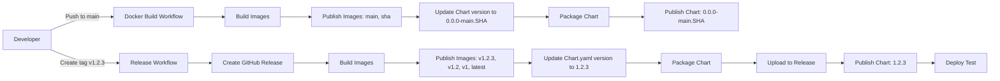

# Helm Chart Release Process

This document describes the process for releasing the `gharts` Helm chart to GitHub Container Registry (GHCR).

## Overview

The Helm chart is automatically published to `oci://ghcr.io/afrittoli/gharts` through GitHub Actions workflows:

- **On main branch push**: Chart is published with a development version (e.g., `0.0.0-main.7f92396`)
- **On release tag**: Chart is published with the semantic version from the release tag (e.g., `1.2.3`)

## Publishing Workflow



## Automatic Release Process

### 1. Create a Release Tag

```bash
# Ensure you're on main and up to date
git checkout main
git pull origin main

# Create and push a version tag
git tag -a v1.2.3 -m "Release version 1.2.3"
git push origin v1.2.3
```

### 2. Automated Steps

The release workflow automatically:

1. **Creates GitHub Release** with release notes
2. **Builds Docker Images** for backend and frontend
3. **Publishes Images** to GHCR with multiple tags
4. **Updates Chart Version** in Chart.yaml to match the release version
5. **Packages Helm Chart** as `.tgz` file (e.g., `gharts-1.2.3.tgz`)
6. **Uploads Chart** to GitHub Release as an asset
7. **Publishes Chart to GHCR** with the semantic version embedded in the package
8. **Deploys Test** to verify the release

### 3. Verify Release

After the workflow completes:

```bash
# Check GitHub Release page
open https://github.com/afrittoli/gha-runner-token-service/releases

# Verify chart in GHCR
helm show chart oci://ghcr.io/afrittoli/gharts --version 1.2.3

# Test installation
helm install test-release oci://ghcr.io/afrittoli/gharts \
  --version 1.2.3 \
  --dry-run \
  --set config.githubAppId=test \
  --set config.githubAppPrivateKey=test \
  --set config.oidcClientId=test \
  --set config.oidcClientSecret=test \
  --set config.oidcDiscoveryUrl=https://example.com/.well-known/openid-configuration \
  --set bootstrap.admin.password=test
```

## Main Branch Publishing

Every push to the `main` branch automatically publishes the chart with development tags:

```bash
# After merging a PR to main
# Workflow automatically publishes chart with:
# - main (branch name)
# - sha-<commit> (commit SHA)
```

These tags are useful for testing unreleased changes:

```bash
# Install from main branch
helm install test oci://ghcr.io/afrittoli/gharts --version main

# Install from specific commit
helm install test oci://ghcr.io/afrittoli/gharts --version sha-abc123def
```

## Manual Release (Emergency)

If automated release fails, you can manually publish:

### 1. Build and Package

```bash
# Update version in Chart.yaml
VERSION=1.2.3
sed -i "s/^version:.*/version: ${VERSION}/" helm/gharts/Chart.yaml
sed -i "s/^appVersion:.*/appVersion: \"${VERSION}\"/" helm/gharts/Chart.yaml

# Package chart
helm package helm/gharts
```

### 2. Login to GHCR

```bash
# Create a Personal Access Token with packages:write permission
# Then login
echo $GITHUB_TOKEN | helm registry login ghcr.io -u USERNAME --password-stdin
```

### 3. Push Chart

```bash
VERSION=1.2.3

# Push with full version
helm push gharts-${VERSION}.tgz oci://ghcr.io/afrittoli

# Push with major.minor
MAJOR_MINOR=$(echo "$VERSION" | cut -d. -f1,2)
helm push gharts-${VERSION}.tgz oci://ghcr.io/afrittoli --version ${MAJOR_MINOR}

# Push with major
MAJOR=$(echo "$VERSION" | cut -d. -f1)
helm push gharts-${VERSION}.tgz oci://ghcr.io/afrittoli --version ${MAJOR}

# Push as latest
helm push gharts-${VERSION}.tgz oci://ghcr.io/afrittoli --version latest
```

## Version Management

### Semantic Versioning

The chart follows [Semantic Versioning](https://semver.org/):

- **MAJOR** version: Incompatible API changes
- **MINOR** version: Backwards-compatible functionality additions
- **PATCH** version: Backwards-compatible bug fixes

### Chart vs Application Version

- **Chart version**: Version of the Helm chart itself
- **App version**: Version of the application being deployed

Both are kept in sync and updated together during releases.

### Version Tags

| Tag Type | Example | Use Case |
|----------|---------|----------|
| Exact | `1.2.3` | Production deployments |
| Minor | `1.2` | Auto-update patches |
| Major | `1` | Auto-update minor versions |
| Latest | `latest` | Always get newest stable |
| Branch | `main` | Testing unreleased changes |
| Commit | `sha-abc123` | Testing specific commits |

## Rollback Procedure

If a release has issues:

### 1. Identify Previous Version

```bash
# List available versions
helm search repo gharts --versions

# Or check GitHub releases
open https://github.com/afrittoli/gha-runner-token-service/releases
```

### 2. Rollback Deployment

```bash
# Rollback to previous version
helm upgrade gharts oci://ghcr.io/afrittoli/gharts --version 1.2.2

# Or use Helm rollback
helm rollback gharts
```

### 3. Update Latest Tag (if needed)

If the `latest` tag points to a bad release:

```bash
# Manually push previous version as latest
helm push gharts-1.2.2.tgz oci://ghcr.io/afrittoli --version latest
```

## Troubleshooting

### Chart Not Found

```bash
# Verify chart exists in GHCR
helm show chart oci://ghcr.io/afrittoli/gharts --version 1.2.3

# Check GitHub Packages page
open https://github.com/afrittoli?tab=packages
```

### Authentication Issues

```bash
# Ensure you're logged in
helm registry login ghcr.io

# Check token permissions (needs packages:read)
# For public charts, authentication may not be required
```

### Version Conflicts

```bash
# If version already exists, you cannot overwrite
# You must create a new version

# Check existing versions
helm search repo gharts --versions
```

### Workflow Failures

1. Check workflow logs in GitHub Actions
2. Verify all secrets are configured:
   - `GITHUB_TOKEN` (automatic)
3. Ensure Chart.yaml is valid:
   ```bash
   helm lint helm/gharts
   ```

## Best Practices

### Before Releasing

1. **Test Locally**
   ```bash
   make helm-test
   make helm-install-local
   ```

2. **Update Documentation**
   - Update CHANGELOG.md
   - Update version references in docs
   - Review README.md

3. **Test in Staging**
   - Deploy to staging environment
   - Run integration tests
   - Verify all features work

### Release Checklist

- [ ] All tests passing in CI
- [ ] Documentation updated
- [ ] CHANGELOG.md updated
- [ ] Version numbers decided
- [ ] Staging deployment successful
- [ ] Breaking changes documented
- [ ] Migration guide written (if needed)

### After Releasing

1. **Verify Release**
   - Check GitHub Release page
   - Test chart installation
   - Verify GHCR package page

2. **Announce Release**
   - Update project README
   - Notify users (if applicable)
   - Post in relevant channels

3. **Monitor**
   - Watch for issues
   - Monitor deployment metrics
   - Be ready to rollback if needed

## CI/CD Integration

### GitHub Actions Workflows

1. **helm-chart.yml**: Validates chart on every PR
   - Lints chart
   - Validates templates
   - Deploys to test cluster
   - Runs Helm tests

2. **docker-build.yml**: Publishes on main branch
   - Builds images
   - Publishes images with `main`, `sha-<commit>` tags
   - Publishes chart with same tags

3. **release.yml**: Publishes on release tags
   - Creates GitHub Release
   - Builds and publishes images
   - Publishes chart with semantic version tags
   - Runs deployment verification

### Local Development

```bash
# Run all chart tests
make helm-test

# Package chart
make helm-package

# Install locally
make helm-install-local

# Clean up
make helm-uninstall-local
```

## References

- [Helm OCI Support](https://helm.sh/docs/topics/registries/)
- [GitHub Container Registry](https://docs.github.com/en/packages/working-with-a-github-packages-registry/working-with-the-container-registry)
- [Semantic Versioning](https://semver.org/)
- [Helm Best Practices](https://helm.sh/docs/chart_best_practices/)

## Support

For issues or questions:

- [GitHub Issues](https://github.com/afrittoli/gha-runner-token-service/issues)
- [Deployment Guide](./deployment_checklist.md)
- [Kubernetes Runbook](./kubernetes_runbook.md)