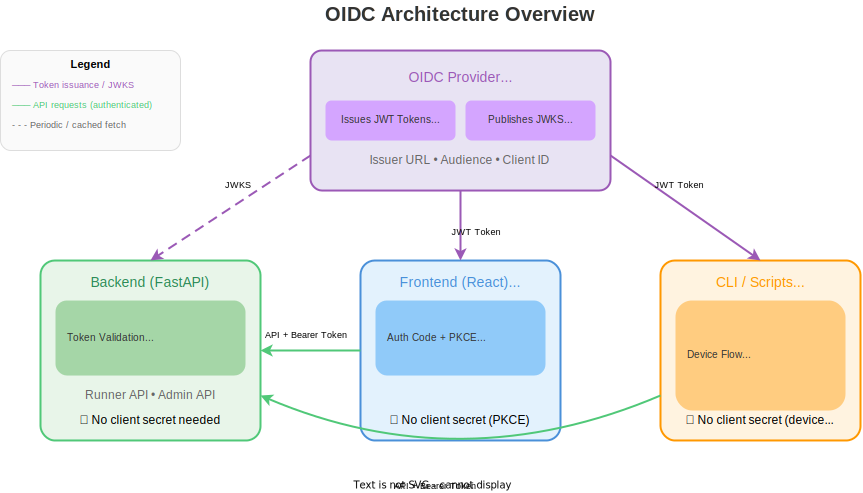
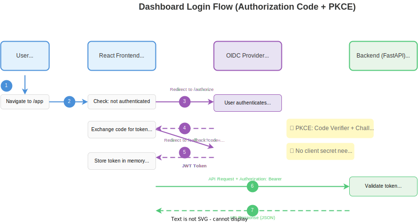
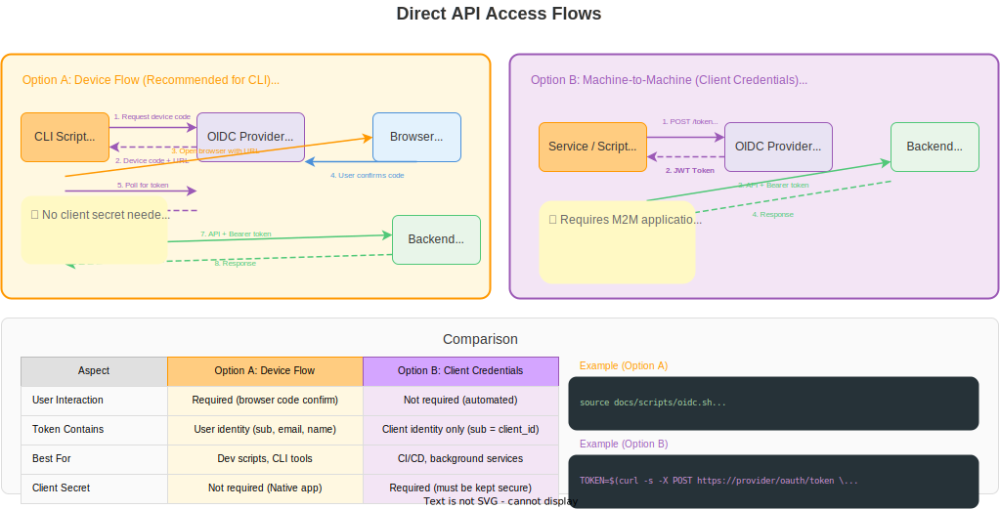

# OIDC Setup Guide

This guide explains the OIDC architecture, configuration, and setup for the Runner Token Service.

## Table of Contents

- [Architecture Overview](#architecture-overview)
- [Authentication Flows](#authentication-flows)
- [Configuration Reference](#configuration-reference)
- [OIDC Provider Setup (Auth0 Example)](#oidc-provider-setup-auth0-example)
- [Obtaining Tokens](#obtaining-tokens)
- [User Authorization](#user-authorization)
- [Development Without OIDC](#development-without-oidc)
- [Troubleshooting](#troubleshooting)

## Architecture Overview

The Runner Token Service uses OpenID Connect (OIDC) for authentication. The architecture separates concerns between:

- **OIDC Provider**: Issues and signs JWT tokens (e.g., Auth0, Okta, Keycloak)
- **Backend (FastAPI)**: Validates tokens using public keys from the provider's JWKS endpoint
- **Frontend (React)**: Handles user login flow and token management
- **CLI/Scripts**: Alternative way to obtain tokens for API access



### Key Concepts

| Component | Purpose |
|-----------|---------|
| **Issuer** | The OIDC provider's base URL that issues tokens |
| **Audience** | Identifies which API the token is intended for |
| **Client ID** | Identifies the application requesting authentication |
| **JWKS** | JSON Web Key Set - public keys for token verification |

### Token Validation

The backend validates JWT tokens using **asymmetric cryptography**:

1. Client sends request with `Authorization: Bearer <token>` header
2. Backend fetches public keys from the OIDC provider's JWKS endpoint (cached)
3. Backend verifies:
   - **Signature**: Token was signed by the provider's private key
   - **Issuer (`iss`)**: Matches configured `OIDC_ISSUER`
   - **Audience (`aud`)**: Contains configured `OIDC_AUDIENCE`
   - **Expiration (`exp`)**: Token hasn't expired

No client secrets are needed for validation - only public keys.

## Authentication Flows

### Dashboard Login Flow (Authorization Code with PKCE)

This flow is used when users access the React dashboard.



1. User navigates to the dashboard (`/app`)
2. React app redirects to OIDC provider's authorization endpoint
3. User authenticates with the OIDC provider
4. Provider redirects back to callback URL with authorization code
5. React app exchanges code for tokens (using PKCE - no client secret)
6. React app stores tokens and includes them in API requests
7. Backend validates token and processes request

### Direct API Access Flow

This flow is used by CLI tools, scripts, or other automated clients.



**Option A: Device Flow (Recommended for CLI)**
1. Script requests device code from OIDC provider
2. Script opens browser with verification URL
3. User authenticates and confirms device code
4. Script polls token endpoint until authentication completes
5. Script uses token for API requests

This is the recommended approach for CLI tools as it doesn't require running a local callback server.

**Option B: Machine-to-Machine (Client Credentials)**
1. Service authenticates directly with client ID and secret
2. Provider issues token without user interaction
3. Service uses token for API requests

Note: M2M tokens contain no user context (sub = client_id, no email).

## Configuration Reference

### Backend Configuration

The backend requires these environment variables in `.env.local`:

| Variable | Required | Description | Example |
|----------|----------|-------------|---------|
| `ENABLE_OIDC_AUTH` | No | Enable/disable OIDC authentication (default: `true`) | `true` |
| `OIDC_ISSUER` | Yes* | OIDC provider's issuer URL (with trailing slash) | `https://provider.example.com/` |
| `OIDC_AUDIENCE` | Yes* | Expected audience claim in tokens | `runner-token-service` |
| `OIDC_JWKS_URL` | Yes* | URL to fetch public keys for token verification | `https://provider.example.com/.well-known/jwks.json` |
| `ADMIN_IDENTITIES` | No | Comma-separated list of admin users (email or sub) | `admin@example.com,sub|123` |

*Required when `ENABLE_OIDC_AUTH=true`

Example `.env.local`:

```bash
# Enable OIDC authentication
ENABLE_OIDC_AUTH=true

# OIDC Provider configuration
OIDC_ISSUER=https://your-provider.example.com/
OIDC_AUDIENCE=runner-token-service
OIDC_JWKS_URL=https://your-provider.example.com/.well-known/jwks.json

# Admin users (bootstrap mode - use User table for production)
ADMIN_IDENTITIES=admin@example.com
```

### Frontend Configuration

The React frontend requires these environment variables in `frontend/.env.local`:

| Variable | Required | Description | Example |
|----------|----------|-------------|---------|
| `VITE_OIDC_AUTHORITY` | Yes | OIDC provider's base URL (without trailing slash) | `https://provider.example.com` |
| `VITE_OIDC_CLIENT_ID` | Yes | Client ID for the web application | `abc123def456` |
| `VITE_OIDC_AUDIENCE` | Yes | API audience identifier (must match backend `OIDC_AUDIENCE`) | `runner-token-service` |
| `VITE_OIDC_REDIRECT_URI` | Yes | Callback URL after login | `http://localhost:5173/callback` |
| `VITE_OIDC_POST_LOGOUT_REDIRECT_URI` | Yes | Redirect URL after logout | `http://localhost:5173` |
| `VITE_API_BASE_URL` | No | API base URL (defaults to same origin) | `http://localhost:8000` |

Example `frontend/.env.local` (development):

```bash
# OIDC Provider
VITE_OIDC_AUTHORITY=https://your-provider.example.com
VITE_OIDC_CLIENT_ID=your-client-id
VITE_OIDC_AUDIENCE=runner-token-service

# Redirect URIs (must be registered with OIDC provider)
VITE_OIDC_REDIRECT_URI=http://localhost:5173/callback
VITE_OIDC_POST_LOGOUT_REDIRECT_URI=http://localhost:5173

# API URL (optional - defaults to same origin)
# VITE_API_BASE_URL=http://localhost:8000
```

**Note:** For production, use your production domain with `/app` path:
- `VITE_OIDC_REDIRECT_URI=https://your-domain.com/app/callback`
- `VITE_OIDC_POST_LOGOUT_REDIRECT_URI=https://your-domain.com/app`

### OIDC Provider Requirements

Your OIDC provider must be configured with:

1. **An API/Resource Server** with an identifier (used as `audience`)
2. **A Single Page Application (SPA)** for the React dashboard:
   - Client ID
   - Allowed callback URLs for login redirects
   - Allowed logout URLs for post-logout redirects
   - Allowed web origins for CORS (frontend URL)
   - No client secret required (uses PKCE)
3. **A Native Application** for CLI scripts (optional):
   - Client ID
   - Device flow enabled
   - No client secret required

## OIDC Provider Setup (Auth0 Example)

This section provides step-by-step instructions for setting up Auth0 as your OIDC provider. Similar concepts apply to other providers (Okta, Keycloak, etc.).

### Auth0 Architecture

```
┌─────────────────────────────────────────────────────────────────────────────────────┐
│                              Auth0 Tenant                                            │
│                    (your-tenant.region.auth0.com)                                   │
│                                                                                      │
│  ┌───────────────────┐    ┌───────────────────┐    ┌───────────────────┐            │
│  │   API Definition  │    │  SPA Application  │    │ Native Application│            │
│  │ (runner-token-svc)│    │   (Dashboard)     │    │  (CLI Scripts)    │            │
│  │                   │    │                   │    │                   │            │
│  │ • Identifier =    │    │ • Client ID       │    │ • Client ID       │            │
│  │   audience        │    │ • Callback URLs   │    │ • Device flow     │            │
│  │ • Token settings  │    │ • PKCE (no secret)│    │ • No secret needed│            │
│  └───────────────────┘    └───────────────────┘    └───────────────────┘            │
│           │                        │                        │                        │
│           │ validates              │ authenticates          │ authenticates          │
│           ▼                        ▼                        ▼                        │
└─────────────────────────────────────────────────────────────────────────────────────┘
            │                        │                        │
    ┌───────┴────────────────────────┴────────────────────────┘
    │                                │
    ▼                                ▼
┌──────────────────┐      ┌──────────────────┐
│  Backend/FastAPI │      │ React Frontend   │
│                  │      │ CLI Scripts      │
│  Validates JWT   │◄─────│                  │
│  using JWKS      │      │ Sends JWT token  │
└──────────────────┘      └──────────────────┘
```

### Step 1: Create Auth0 Account and Tenant

1. Go to [auth0.com](https://auth0.com) and sign up (free tier is sufficient)
2. Create a new tenant or use the default one
3. Note your tenant domain: `your-tenant.region.auth0.com`

### Step 2: Create API Definition

The API definition tells Auth0 what `audience` to include in tokens.

1. Go to **Applications → APIs** in the Auth0 dashboard
2. Click **Create API**
3. Configure:

| Setting | Value |
|---------|-------|
| **Name** | Runner Token Service |
| **Identifier** | `runner-token-service` |
| **Signing Algorithm** | RS256 |

4. Click **Create**

The **Identifier** becomes your `OIDC_AUDIENCE` value.

### Step 3: Create Single Page Application (Dashboard)

1. Go to **Applications → Applications**
2. Click **Create Application**
3. Configure:

| Setting | Value |
|---------|-------|
| **Name** | Runner Token Service Dashboard |
| **Application Type** | Single Page Application |

4. Click **Create**
5. Go to the **Settings** tab and note:
   - **Domain**: `your-tenant.region.auth0.com`
   - **Client ID**: (auto-generated)

6. Configure URLs (comma-separated for multiple values):

**Allowed Callback URLs:**
```
http://localhost:5173/callback
```

**Allowed Logout URLs:**
```
http://localhost:5173
```

**Allowed Web Origins:**
```
http://localhost:5173
```

7. Scroll down and click **Save Changes**

**Notes:**
- SPA applications use PKCE and don't require a client secret
- Add production URLs when deploying

### Step 4: Create Native Application (CLI Scripts)

1. Go to **Applications → Applications**
2. Click **Create Application**
3. Configure:

| Setting | Value |
|---------|-------|
| **Name** | Runner Token Service CLI |
| **Application Type** | Native |

4. Click **Create**
5. Go to the **Settings** tab and note:
   - **Client ID**: (auto-generated)

6. Scroll down to **Advanced Settings → Grant Types**
7. Enable **Device Code** grant type
8. Click **Save Changes**

**Notes:**
- Native applications with device flow are ideal for CLI tools
- No client secret is needed for device flow

### Step 5: Configure Environment Files

#### Backend `.env.local`

```bash
# OIDC Configuration
ENABLE_OIDC_AUTH=true
OIDC_ISSUER=https://your-tenant.region.auth0.com/
OIDC_AUDIENCE=runner-token-service
OIDC_JWKS_URL=https://your-tenant.region.auth0.com/.well-known/jwks.json

# Admin users (use email or Auth0 user ID)
ADMIN_IDENTITIES=your-email@example.com
```

#### Frontend `frontend/.env.local`

```bash
# Auth0 Configuration (use SPA Client ID from Step 3)
VITE_OIDC_AUTHORITY=https://your-tenant.region.auth0.com
VITE_OIDC_CLIENT_ID=your-spa-client-id-from-step-3
VITE_OIDC_AUDIENCE=runner-token-service

# Redirect URIs (development)
VITE_OIDC_REDIRECT_URI=http://localhost:5173/callback
VITE_OIDC_POST_LOGOUT_REDIRECT_URI=http://localhost:5173
```

#### CLI Scripts (Environment Variables)

For the `docs/scripts/oidc.sh` helper:

```bash
export AUTH0_DOMAIN="your-tenant.region.auth0.com"
export AUTH0_NATIVE_CLIENT_ID="your-native-client-id-from-step-4"
```

Note: The CLI script uses the device flow which doesn't require a client secret.

### Step 6: (Optional) Create Machine-to-Machine Application

Only needed for service accounts that authenticate without user interaction.

1. Go to **Applications → Applications**
2. Click **Create Application**
3. Select **Machine to Machine Applications**
4. Name it "Runner Token Service M2M"
5. Select **Runner Token Service** API and authorize it
6. Note the Client ID and Client Secret

**Note**: M2M tokens contain no user context - the `sub` claim is the client_id, not a user identifier.

## Obtaining Tokens

### Option 1: React Frontend (Recommended for Users)

1. Start the backend: `python -m uvicorn app.main:app`
2. Start the frontend: `cd frontend && npm run dev`
3. Navigate to `http://localhost:5173/app`
4. Click "Sign in with SSO"
5. Complete authentication with your OIDC provider
6. Token is automatically managed by the frontend

### Option 2: CLI Script with Device Flow (Recommended for Development)

Use the helper script that uses device flow for authentication:

```bash
# Set required environment variables
export AUTH0_DOMAIN="your-tenant.region.auth0.com"
export AUTH0_NATIVE_CLIENT_ID="your-native-client-id"

# Source the script
source docs/scripts/oidc.sh

# Get a token (opens browser for login, displays code to confirm)
TOKEN=$(get_oidc_token)

# Use the token
curl -H "Authorization: Bearer $TOKEN" http://localhost:8000/api/v1/runners
```

The device flow works as follows:
1. Script requests a device code from Auth0
2. Script opens browser with verification URL
3. User logs in and confirms the displayed code
4. Script polls until authentication completes
5. Token is returned

**Requirements:**
- Native application with Device Code grant enabled (Step 4)
- `jq` must be installed
- macOS `open` command (modify script for Linux: use `xdg-open`)

See [docs/scripts/oidc.sh](scripts/oidc.sh) for implementation details.

### Option 3: Resource Owner Password Grant (Testing Only)

For automated testing where browser login isn't possible.

**Warning**: This requires enabling "Password" grant in your OIDC provider and is not recommended for production.

```bash
curl -s --request POST \
  --url "https://${AUTH0_DOMAIN}/oauth/token" \
  --header "content-type: application/json" \
  --data '{
    "client_id": "'"${AUTH0_WEB_CLIENT_ID}"'",
    "client_secret": "'"${AUTH0_WEB_CLIENT_SECRET}"'",
    "audience": "'"${AUTH0_AUDIENCE}"'",
    "grant_type": "http://auth0.com/oauth/grant-type/password-realm",
    "username": "your-email@example.com",
    "password": "your-password",
    "realm": "Username-Password-Authentication"
  }' | jq -r '.access_token'
```

### Option 4: Client Credentials (Service Accounts)

For automated services without user context:

```bash
curl -s --request POST \
  --url "https://${AUTH0_DOMAIN}/oauth/token" \
  --header "content-type: application/json" \
  --data '{
    "client_id": "'"${AUTH0_M2M_CLIENT_ID}"'",
    "client_secret": "'"${AUTH0_M2M_CLIENT_SECRET}"'",
    "audience": "'"${AUTH0_AUDIENCE}"'",
    "grant_type": "client_credentials"
  }' | jq -r '.access_token'
```

## User Authorization

The Runner Token Service uses an explicit allowlist approach: users must exist in the application's User table before they can access the API. This provides fine-grained control over who can use the service.

### Authorization Model

| Field | Description |
|-------|-------------|
| `email` / `oidc_sub` | User identity (matched from OIDC token claims) |
| `is_admin` | Can manage users and access admin endpoints |
| `is_active` | Whether the user can access the API (soft delete) |
| `can_use_registration_token` | Can use the `/provision` endpoint |
| `can_use_jit` | Can use the `/jit` endpoint |

### Bootstrap Mode (First Admin Setup)

When no users exist in the database, the system enters **bootstrap mode**:

1. Any authenticated user can access the API (including admin endpoints)
2. This allows the first admin to create user accounts
3. Once any user exists, bootstrap mode is disabled

**To set up your first admin:**

#### Option A: Use the CLI (Recommended)

```bash
# Create the first admin user
python -m app.cli create-admin \
  --email your-email@example.com \
  --display-name "Your Name"

# Verify the user was created
python -m app.cli list-users
```

#### Option B: Use the Dashboard in Bootstrap Mode

1. Ensure no users exist in the database (fresh installation)
2. Log in to the dashboard with your OIDC account
3. Navigate to Users management (you have temporary admin access)
4. Create your admin user with your email address and `is_admin=true`
5. Log out and log back in - your permissions now come from the database

#### Option C: Use the API in Bootstrap Mode

```bash
# Get a token (using device flow)
source docs/scripts/oidc.sh
TOKEN=$(get_oidc_token)

# Create the first admin user
curl -X POST http://localhost:8000/api/v1/admin/users \
  -H "Authorization: Bearer $TOKEN" \
  -H "Content-Type: application/json" \
  -d '{
    "email": "your-email@example.com",
    "display_name": "Your Name",
    "is_admin": true,
    "can_use_registration_token": true,
    "can_use_jit": true
  }'
```

### Managing Users

Once you have an admin account, you can manage users via:

**CLI Commands:**
```bash
# Create a regular user
python -m app.cli create-admin --email user@example.com  # Note: remove is_admin flag in the API

# List all users
python -m app.cli list-users

# List only admins
python -m app.cli list-users --admins-only
```

**Admin API Endpoints:**
- `POST /api/v1/admin/users` - Create user
- `GET /api/v1/admin/users` - List users (paginated)
- `GET /api/v1/admin/users/{id}` - Get user details
- `PUT /api/v1/admin/users/{id}` - Update user
- `DELETE /api/v1/admin/users/{id}` - Deactivate user
- `POST /api/v1/admin/users/{id}/activate` - Reactivate user

## Development Without OIDC

For local development without setting up an OIDC provider:

```bash
# In .env.local
ENABLE_OIDC_AUTH=false
```

This disables token validation and uses a mock user for all requests. The mock user has admin privileges.

## Troubleshooting

### "Origin not allowed" CORS Error

**Symptom**: Browser console shows CORS error when frontend tries to contact OIDC provider.

**Solution**: Add the frontend origin to your OIDC provider's "Allowed Web Origins":
- `http://localhost:5173` (no trailing slash)

### "Invalid audience" Error

**Symptom**: Backend rejects token with "invalid audience" error.

**Solution**:
1. Decode the token at [jwt.io](https://jwt.io) and check the `aud` claim
2. Ensure it matches `OIDC_AUDIENCE` in backend `.env.local`
3. Ensure the frontend requests the correct audience (check `main.tsx`)

### "Invalid issuer" Error

**Symptom**: Backend rejects token with "invalid issuer" error.

**Solution**:
- The `iss` claim must **exactly** match `OIDC_ISSUER`
- Auth0 issuer URLs have a trailing slash: `https://tenant.auth0.com/`
- Check both the token and your `.env.local`

### Token Not Included in API Requests / 401 Unauthorized

**Symptom**: API requests fail with 401 Unauthorized even after successful login.

**Cause**: Without the `audience` parameter, Auth0 returns an opaque access token instead of a JWT. The backend cannot validate opaque tokens.

**Solution**: Ensure the frontend requests the correct audience:

1. Set `VITE_OIDC_AUDIENCE=runner-token-service` in `frontend/.env.local`
2. Or verify that `extraQueryParams.audience` is set in `frontend/src/main.tsx`:

```typescript
const oidcConfig = {
  // ...
  scope: 'openid profile email',
  extraQueryParams: { audience: 'runner-token-service' }  // Critical for JWT!
}
```

3. After changing the audience, you must **log out and log back in** to get a new token with the correct audience.

### "User not authorized" After Successful Login

**Symptom**: User logs in successfully but gets 403 Forbidden with "User not authorized. Contact administrator to request access."

**Cause**: The user doesn't exist in the application's User table. The system uses an explicit allowlist - users must be pre-created by an admin.

**Solution**:
1. **If you're the first user**: The system should be in bootstrap mode (no users in DB). Check that the database is properly initialized with `python -m app.cli list_users`. If it shows users but you're not one of them, contact an existing admin.

2. **If you're a regular user**: Ask an admin to create your account via the dashboard or API.

3. **If you're an admin creating the first user**: Use the CLI:
   ```bash
   python -m app.cli create-admin --email your-email@example.com
   ```

See [User Authorization](#user-authorization) for more details on the authorization model.

### CLI Script Device Flow Issues

**Symptom**: `get_oidc_token` hangs or the code doesn't match.

**Solution**:
1. Ensure the Native application has Device Code grant enabled
2. Verify `AUTH0_NATIVE_CLIENT_ID` is set correctly
3. Make sure to confirm the code shown in the terminal matches the one in the browser
4. Check Auth0 logs for any authentication errors
